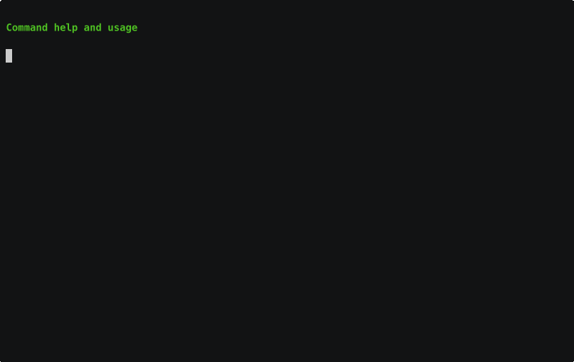
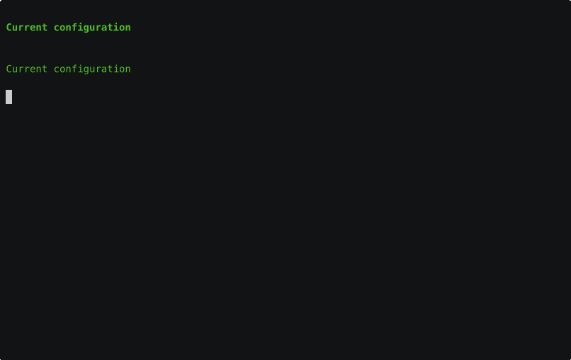

# BkpDir - Intelligent Directory Archiving CLI

A powerful command-line tool for creating and managing directory archives with intelligent incremental backups, git integration, and flexible configuration.

## Unreleased changes (summary)

Work on the current branch includes:

- **Default `exclude_patterns`**: The built-in default is an **empty** list (nothing excluded until you configure it). Add `.git/`, `vendor/`, `node_modules/`, etc. in YAML if you want those skipped.
- **Config merge**: In the first config file loaded, an unprefixed `exclude_patterns` list **replaces** that empty default so project rules take effect without merge-prefix noise.
- **Config errors**: Failed config file reads print a **stderr warning** and a short **YAML hint** (e.g. quoting globs such as `*.tsbuildinfo` when the parser reports alias/anchor issues).
- **Exclusions**: Trailing-slash patterns with a **single** path segment (e.g. `node_modules/`) match that directory name **at any depth** in the tree.
- **Lint / check**: `make lint` runs **TIED MCP validation** (`validate-tied-mcp`) before `revive`; `make check` runs fmt, vet, and lint only—run `make validate-token-enforcement` separately for the optional DOC-008 scan. See [Development](#development).
- **TIED**: REQ/ARCH detail YAML no longer embed invalid `detail_file`; IMPL decision files normalized and pseudocode aligned; canonical registry in `tied/semantic-tokens.yaml`; `project-tokens.yaml` is a short pointer only; agent checklist docs updated.
- **Repository**: Prebuilt platform binaries were **removed** from `bin/` (build locally or via CI).
- **CLI (tests and wiring)**: No change to the commands or flags you use day to day. Internally, the same production Cobra tree (including `diff`, `template`, and root flags) is built once via `newRootCommand()` and tests use that tree, so integration tests stay aligned with the real binary.

### Documentation, TIED paths, and token validation

- **Docs pruned**: Many non-essential `docs/` files (session write-ups, migration logs, duplicate analyses, old working plans) were **removed** on purpose. Normative requirements and decisions live under **`tied/`**; use **git history** or [docs/archive/README.md](docs/archive/README.md) if you need retired narratives.
- **Registry**: **`project-tokens.yaml`** is only a **pointer** to `tied/semantic-tokens.yaml` and the TIED indexes. Do not treat it as a token matrix; extend **`tied/semantic-tokens.yaml`** and detail YAML instead (`[REQ-DOC_016]`).
- **Requirements index**: [`tied/requirements.yaml`](tied/requirements.yaml) and REQ detail files cite concrete **`tied/architecture-decisions/ARCH-*.yaml`** and **`tied/implementation-decisions/IMPL-*.yaml`** paths instead of monolithic `architecture-decisions.md` / `implementation-decisions.md` section references.
- **Tooling alignment**: Refactoring validation tests and coverage differential were updated for removed doc paths (including optional `docs/coverage-baseline.md`).
- **Validation script**: [`scripts/validate-semantic-tokens.sh`](scripts/validate-semantic-tokens.sh) regenerates [`semantic-token-validation-report.md`](semantic-token-validation-report.md) with TIED / canonical-registry wording. The script may still exit **non-zero** when per-file checks fail (e.g. remaining Unicode icons), but it **writes the report** before exiting.

## 📹 Visual Demonstrations

**Explore short demos that show bkpdir’s help, everyday usage, and configuration workflows.** Each GIF links to the matching section in this README so you can jump straight into details.

[](#most-common-commands)

In this demo, bkpdir turns one configuration file into a repeatable task runner for your backups, letting you standardize archive locations, exclusions, and naming across projects.  

[](#complex-usage-scenario)

The configuration system is highly flexible, with layered YAML files, inheritance, and customizable format strings that let you control archive naming, exclusions, and output formatting for different workflows.

[](#configuration)

## Most Common Commands

### `bkpdir .` - Archive Current Directory

**The most frequently used command** - creates a full archive of your current working directory.

```bash
# Navigate to your project directory
cd ~/projects/myapp

# Create a full archive of the current directory
bkpdir .
```

**How it works:**
1. **Auto-detection**: bkpdir automatically detects that `.` is a directory path
2. **Configuration loading**: Searches for `.bkpdir.yml` in the current directory and parent directories
3. **Archive creation**: Creates a complete ZIP archive of all files in the current directory
4. **Smart naming**: Archive name includes:
   - Current directory name (if `use_current_dir_name: true`)
   - Timestamp
   - Git branch and commit hash (if `include_git_info: true`)
   - Dirty status suffix (if `show_git_dirty_status: true` and repo has uncommitted changes)

**Example output:**
```
Created archive: myapp-2024-01-15-143022-main-abc123.zip
```

**With optional note:**
```bash
bkpdir . "Before major refactoring"
```

### `bkpdir inc` - Incremental Archive

**The second most common command** - creates an incremental archive containing only files that changed since the last archive.

```bash
# Create an incremental archive (only changed files)
bkpdir inc
```

**How it works:**
1. **Comparison**: Compares current directory state with the most recent archive
2. **Change detection**: Identifies new, modified, or deleted files
3. **Archive creation**: Creates a ZIP archive containing only the changed files
4. **Efficiency**: Much smaller archives, faster creation time

**Use cases:**
- Daily backups of active projects
- Version control for incremental changes
- Space-efficient archiving workflows

## Complex Usage Scenario

This example demonstrates a complete workflow using multiple bkpdir commands to create, update, and report on archives over time.

### Scenario: Managing Project Archives Over Time

Imagine you're working on a software project and want to maintain a complete archive history with incremental backups:

```bash
# Navigate to your project directory
cd ~/projects/myapp

# Day 1: Create initial full archive of current directory
bkpdir .

# Day 2: After making changes, create an incremental archive
bkpdir inc

# Day 3: Create another incremental archive
bkpdir inc

# List all archives
bkpdir list

# Check configuration
bkpdir config
```

### Using Configuration Files

For more control and automation, use configuration files:

**Step 1: Generate a configuration template** (recommended first step):

```bash
# Generate a template with all available options and their default values
bkpdir template
```

This command outputs a complete configuration template showing all available options and their default values. Save this output to `.bkpdir.yml` and customize as needed.

**Step 2: Create a basic configuration file** (`.bkpdir.yml`):

You can either use the template from Step 1, or create a minimal configuration file:

```yaml
# .bkpdir.yml
archive_dir_path: "./archives"
use_current_dir_name: true

# Exclude patterns for files/directories to skip
exclude_patterns:
  - ".git/"
  - "node_modules/"
  - "*.tmp"
  - "*.log"

# Git integration settings (top-level keys)
# Enable Git info in archive names (branch and commit hash)
include_git_info: true
show_git_dirty_status: true  # Add "-dirty" suffix when repo has uncommitted changes
include_branch: true

```

**Step 3: Create archives using the configuration:**

```bash
# Navigate to your project directory
cd ~/projects/myapp

# Create archive using configuration file
bkpdir .

# Create incremental archive (uses config settings)
bkpdir inc

# List archives
bkpdir list

# View configuration
bkpdir config
```

**Step 4: Use advanced configuration with inheritance:**

Create a base configuration (`base-config.yml`):

```yaml
# base-config.yml
archive_dir_path: "~/Archives"
use_current_dir_name: true

# Common exclusion patterns
exclude_patterns:
  - ".git/"
  - "vendor/"
  - "node_modules/"
  - "*.log"

# Git settings
include_git_info: false
show_git_dirty_status: true

```

Create a project-specific configuration (`.bkpdir.yml`):

```yaml
# .bkpdir.yml
inherit:
  - "../base-config.yml"

# Override archive directory for this project
archive_dir_path: "./archives"

# Add project-specific exclusions (merged with base)
+exclude_patterns:
  - "dist/"
  - "build/"
  - "*.cache"

# Enable Git integration for this project
include_git_info: true
show_git_dirty_status: true
include_branch: true
```

**Step 5: Run operations with configuration:**

```bash
# All commands now use the configuration file automatically
cd ~/projects/myapp

# Create archive (uses .bkpdir.yml)
bkpdir .

# Create incremental (inherits from base-config.yml)
bkpdir inc

# List archives
bkpdir list

# View effective configuration
bkpdir config
```

## Quick Start

### Installation

```bash
# Build and install locally
make build-local
make install

# Or run directly
go run main.go --help
```

### Basic Usage

```bash
# Create full archive of current directory (most common)
bkpdir .

# Create incremental archive (second most common)
bkpdir inc

# Create full archive of specific directory
bkpdir /path/to/directory

# List all archives
bkpdir list

# Alternative: Explicit commands (less common)
bkpdir create /path/to/directory
bkpdir create /path/to/directory --incremental
```

## AI-First Development

### Semantic Token System

This project uses a **semantic token system** for AI-optimized development:

```go
// [CRITICAL] ARCH-001: Archive naming convention [ACTION:core-functionality]
// [HIGH] CFG-003: Template formatting logic [ACTION:format-processing]
// [MEDIUM] GIT-004: Git submodule support [ACTION-discovery]
```

**Key Benefits:**
- **Perfect searchability**: `grep "\[CRITICAL\]" *.go` works everywhere
- **AI-native**: Semantic parsing vs visual interpretation
- **Cross-platform**: No Unicode or font dependencies
- **Maintainable**: Single source of truth in `tied/semantic-tokens.yaml` (see `project-tokens.yaml` for legacy pointer metadata)

### Development Requirements

All development work must comply with:

1. **Semantic tokens** - Use `[CRITICAL|HIGH|MEDIUM|LOW] FEATURE-ID: Description [ACTION-context]`
2. **Validation** - Pass `make validate-token-enforcement`
3. **Registry compliance** - Use tokens registered in `tied/semantic-tokens.yaml`
4. **Documentation consistency** - Keep tokens aligned across all files
5. **Milestone tracking** - Document completion of major milestones during development

See [Semantic Token System Requirements](docs/semantic-token-system-requirements.md) for complete details.

## Project Structure

```
bkpdir/
├── main.go                    # CLI entry point
├── archive.go                 # Archive operations
├── backup.go                  # Backup operations
├── config.go                  # Configuration management
├── pkg/                       # Extracted packages
│   ├── cli/                   # CLI framework
│   ├── config/                # Configuration loading
│   ├── errors/                # Error handling
│   ├── fileops/               # File operations
│   ├── formatter/             # Output formatting
│   ├── git/                   # Git integration
│   ├── processing/            # Processing pipelines
│   ├── resources/             # Resource management
│   └── testutil/              # Testing utilities
├── scripts/                   # Build and validation scripts
├── docs/                      # Documentation
├── tied/                      # TIED: REQ/ARCH/IMPL YAML (canonical token registry)
└── project-tokens.yaml        # Legacy pointer to tied/ (do not extend with token matrices)
```

## Features

### Core Functionality

- **Archive Creation**: Full and incremental directory archiving
- **Backup Management**: File-level backup with deduplication
- **Git Integration**: Git-aware archiving with branch detection
- **Configuration**: Flexible YAML-based configuration
- **Template System**: Customizable output formatting

### AI-First Architecture

- **Semantic Tokens**: Machine-readable code annotations
- **Validation Integration**: Automated consistency checking
- **Package Extraction**: Modular, reusable components
- **Test Coverage**: Comprehensive testing framework
- **Documentation**: AI-optimized documentation system

## Configuration

> **💡 Tip**: Start with `bkpdir template` to see all available configuration options and their default values. This is the recommended first step when customizing bkpdir locally.

**`exclude_patterns` default:** With no config file, the default is an empty list—archives include every path unless you set exclusions. Examples below show typical patterns (`.git/`, `node_modules/`, …) that you should add explicitly when you want them skipped.

### Basic Configuration

```yaml
# .bkpdir.yml
archive_dir_path: "/path/to/archives"
backup_dir_path: "/path/to/backups"
use_current_dir_name: true

# Exclusion patterns
exclude_patterns:
  - ".git/"
  - "node_modules/"
  - "*.tmp"

# Git integration settings (top-level keys)
include_git_info: true
show_git_dirty_status: true
include_branch: true
```

### Advanced Configuration

```yaml
# Inheritance support (array of config files to inherit from)
inherit:
  - "../base-config.yml"
  - "~/.bkpdir/base.yml"

# Template customization (top-level template keys)
template_created_archive: "{{.Name}}-{{.Date}}-{{.Branch}}"
template_list_archive: "📦 {{.Name}} ({{.Size}})\n"

# Exclusion patterns (top-level array)
exclude_patterns:
  - "*.tmp"
  - "node_modules/"
  - ".git/"

# Git integration (top-level keys)
include_git_info: true
show_git_dirty_status: true
include_branch: true
include_hash: true
```

## Development

### Build Targets

```bash
# Development
make dev                    # Build and test
make build-local           # Build for current platform
make install              # Install to ~/.local/bin

# Testing
make test                 # Run all tests
make test-coverage        # Run with coverage
make test-performance     # Run performance tests

# Quality
make check                # All quality checks (fmt, vet, lint)
make lint                 # TIED YAML via tied-yaml MCP (indexes + consistency), then revive
make validate-tied-mcp    # Only MCP validation (requires Node; path from TIED_YAML_MCP_JS or .cursor/mcp.json)
make validate-token-enforcement  # Optional DOC-008 grep/Unicode semantic token scan

# Production
make build-all           # Build for all platforms
```

### Validation

```bash
# TIED indexes + REQ/ARCH/IMPL consistency (same tools as Cursor tied-yaml MCP)
make validate-tied-mcp
# Optional: DOC-008 repo-wide semantic token / Unicode scan
make validate-token-enforcement

# Strict validation (CI/CD)
make validate-tokens-strict

# Development validation
make validate-tokens
```

`make lint` runs `validate-tied-mcp` first. Set `TIED_YAML_MCP_JS` to your built `mcp-server/dist/index.js` if it is not already in `.cursor/mcp.json` under `tied-yaml` → `args`. `TIED_BASE_PATH` defaults to `./tied` relative to the repo root.

## Token Registry

The project uses a central registry for semantic tokens:

**Canonical registry:** `tied/semantic-tokens.yaml` (indexes + detail under `tied/`). **`project-tokens.yaml`** is a short pointer only.

### Valid Priorities
- `CRITICAL` - Blocking operations, core system integrity
- `HIGH` - Important features, significant business logic
- `MEDIUM` - Secondary features, conditional processing
- `LOW` - Maintenance tasks, cleanup, documentation

### Valid Actions
- `core-functionality` - Essential system operations
- `format-processing` - Text formatting and output generation
- `discovery` - File system and configuration discovery
- `maintenance` - Code cleanup and refactoring
- `validation` - Input validation and error checking

### Feature IDs
- `ARCH-001` - Archive naming convention implementation
- `CFG-003` - Template formatting logic
- `GIT-004` - Git submodule support

## Migration from Legacy Icons

The project is migrating from Unicode icons to semantic tokens:

```bash
# Legacy (deprecated)
// [CRITICAL] ARCH-001: Archive naming convention [ACTION:core-functionality]

# Semantic (required)
// [CRITICAL] ARCH-001: Archive naming convention [ACTION:core-functionality]
```

**Status:** Migration progress is reflected in the codebase and TIED/token tooling. Ad-hoc phase write-ups were removed from [docs/archive/](docs/archive/); use git history if needed (not normative).

## Contributing

### Requirements

1. **Semantic tokens** - All code must use semantic token format
2. **Validation** - Must pass `make validate-token-enforcement`
3. **Testing** - Include comprehensive tests
4. **Documentation** - Update docs with semantic tokens

### Process

1. Fork the repository
2. Create feature branch
3. Implement with semantic tokens
4. Run validation: `make check`
5. Submit pull request

### AI Assistant Guidelines

- **Token system first** - Always use semantic tokens
- **Registry compliance** - Check `tied/semantic-tokens.yaml` for valid tokens
- **Validation integration** - Run validation after changes
- **Consistency maintenance** - Keep tokens aligned across all files

## License

MIT License - see LICENSE file for details.

## Links

- [Documentation](docs/)
- [Semantic token system (pointer)](docs/semantic-token-system-requirements.md) — canonical registry in `tied/semantic-tokens.yaml`
- [AI / developer context](docs/context/README.md)
- [Package Reference](docs/package-reference.md)
- [Migration Guide](docs/migration-guide.md)
- [Docs archive folder](docs/archive/README.md) (placeholder; use git history for old session notes)