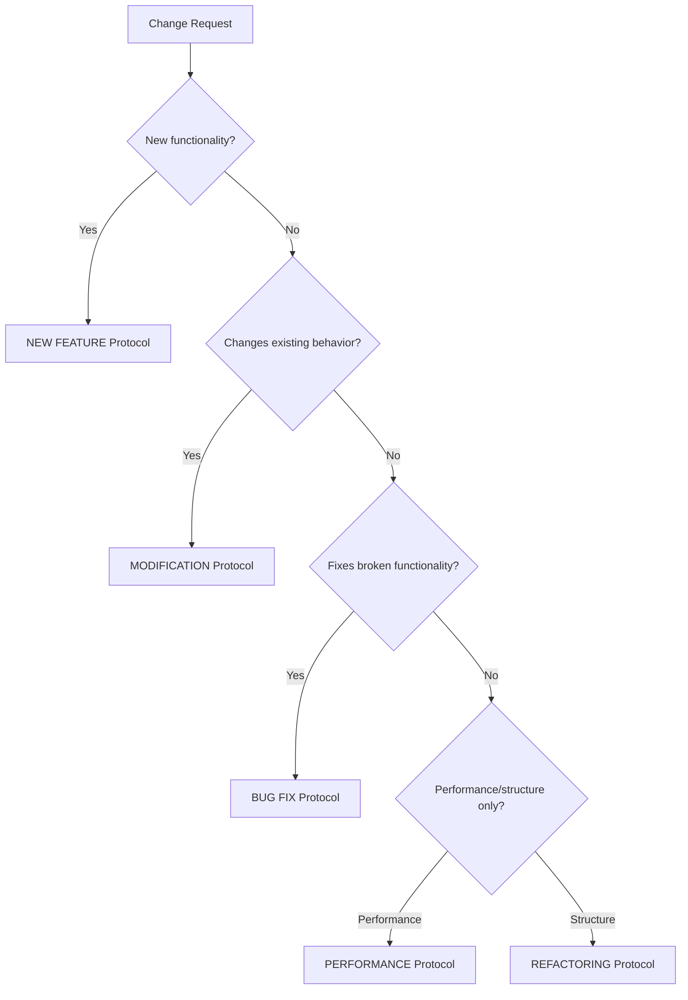

# 🔧 Decision Framework Troubleshooting Guide

> **🔶 DOC-014: Comprehensive troubleshooting scenarios and solutions for AI assistant decision-making**

## 📑 Table of Contents

1. [Common Decision Conflicts](#-common-decision-conflicts)
2. [Validation Failures](#-validation-failures)
3. [Priority Conflicts](#-priority-conflicts)
4. [Scope Boundary Issues](#-scope-boundary-issues)
5. [Quality Threshold Problems](#-quality-threshold-problems)
6. [Goal Alignment Challenges](#-goal-alignment-challenges)
7. [Integration Problems](#-integration-problems)
8. [Emergency Procedures](#-emergency-procedures)

## 🚨 Common Decision Conflicts

### **🔥 Multiple Critical Tasks Available**

**Symptoms**:
- Several ⭐ CRITICAL priority tasks in feature-tracking.md
- Uncertain which to prioritize
- Risk of context switching overhead

**Root Cause Analysis**:
- Feature priority system not granular enough
- Current project phase not clearly defined
- Dependencies not properly mapped

**Solution Process**:
```
1. 📋 Check Current Phase Context
   → grep -A 5 "Current Priority" docs/context/feature-tracking.md
   → Identify phase-critical tasks (extraction, refactoring, etc.)

2. 🔗 Analyze Dependency Chains  
   → Map which tasks unblock the most downstream work
   → Prioritize tasks that enable multiple other tasks

3. 🎯 Consider Strategic Impact
   → Extraction tasks > New features during extraction phase
   → Foundation work > Application features
   → Blocking issues > Enhancement work

4. 🤖 Evaluate AI Assistant Capabilities
   → Choose tasks matching current expertise level
   → Prefer familiar patterns over experimental approaches
```

**Example Resolution**:
```
Available Tasks: EXTRACT-002, REFACTOR-006, TEST-INFRA-002
Current Phase: Component Extraction
Analysis: EXTRACT-002 unblocks EXTRACT-003-006
Decision: EXTRACT-002 (foundation work, high dependency impact)
```

### **⚠️ Conflicting Architecture Requirements**

**Symptoms**:
- Change conflicts with existing architecture patterns
- Multiple valid architectural approaches available
- Uncertainty about architectural decisions

**Root Cause Analysis**:
- Architecture documentation outdated
- Competing architectural goals
- Incomplete architectural guidance

**Solution Process**:
```
1. 📋 Review Current Architecture State
   → docs/context/architecture.md current patterns
   → Identify any architectural debt or inconsistencies

2. 🎯 Evaluate Against Project Goals
   → Component extraction readiness
   → Future reusability requirements
   → Backward compatibility constraints

3. 🔧 Choose Approach That Enables Goals
   → Prefer loose coupling over tight coupling
   → Choose patterns that support extraction
   → Document new patterns if needed

4. 📝 Update Architecture Documentation
   → Document architectural decisions
   → Update patterns in architecture.md
   → Ensure future consistency
```

**Example Resolution**:
```
Conflict: Interface-based vs inheritance-based design
Goal: Component extraction (EXTRACT-002)
Analysis: Interface-based enables extraction, inheritance creates coupling
Decision: Interface-based design, update architecture.md
```

### **🔄 Circular Dependency Deadlocks**

**Symptoms**:
- Task A depends on Task B, which depends on Task A
- No clear starting point for implementation
- Planning paralysis

**Root Cause Analysis**:
- Features not properly decomposed
- Dependencies too coarse-grained
- Missing intermediate tasks

**Solution Process**:
```
1. 🔍 Decompose Dependencies
   → Break circular features into smaller components
   → Identify minimal viable implementations
   → Create intermediate milestone tasks

2. 🛡️ Create Foundation-First Approach
   → Identify foundational components with no dependencies
   → Implement basic infrastructure first
   → Build dependent features incrementally

3. 📋 Update Feature Tracking
   → Add intermediate tasks to feature-tracking.md
   → Update dependency chains
   → Ensure linear progression path exists

4. ✅ Validate Resolution
   → Confirm no remaining circular dependencies
   → Test incremental implementation approach
```

**Example Resolution**:
```
Circular: CFG-005 needs CFG-006, CFG-006 needs CFG-005
Analysis: Both need configuration reflection
Solution: Create CFG-006-base (basic reflection), then CFG-005, then CFG-006-full
```

## 🛡️ Validation Failures

### **❌ Test Failures Blocking Progress**

**Symptoms**:
- `make test` fails, preventing all other work
- Unclear which tests are failing and why
- Test failures in unrelated components

**Diagnostic Process**:
```bash
# 1. Identify failing tests
make test 2>&1 | grep -E "(FAIL|ERROR)" | head -10

# 2. Run specific test packages
go test ./path/to/failing/package -v

# 3. Check test isolation
go test -count=10 ./path/to/failing/package

# 4. Analyze test dependencies
go test -race ./...
```

**Common Causes & Solutions**:

#### **🔧 Configuration Test Isolation Issues**
```
Problem: Tests fail when personal config files exist
Solution: Update TEST-FIX-001 patterns
Actions:
- Set BKPDIR_CONFIG to test-specific paths
- Use temporary directories for test configs
- Ensure cleanup in test teardown
```

#### **🌐 Network/External Dependencies**
```
Problem: Tests fail due to external service dependencies
Solution: Mock external dependencies
Actions:
- Create mock interfaces for external services
- Use dependency injection for testability
- Add build tags for integration vs unit tests
```

#### **🔄 Race Conditions**
```
Problem: Tests fail intermittently with race conditions
Solution: Fix concurrent access patterns
Actions:
- Use sync.Mutex for shared state
- Implement proper channel communication
- Add race detection to CI pipeline
```

### **🏷️ Icon Validation Failures**

**Symptoms**:
- `make validate-icons` fails
- Token format inconsistencies
- Missing implementation tokens

**Diagnostic Process**:
```bash
# 1. Run icon validation with verbose output
./scripts/validate-icon-enforcement.sh --verbose

# 2. Check specific token issues
grep -r "// [^⭐🔺🔶🔻].*:" --include="*.go" .

# 3. Validate token standardization rate
./scripts/validate-decision-framework.sh --format detailed
```

**Common Solutions**:

#### **📋 Missing Implementation Tokens**
```
Problem: New code lacks implementation tokens
Solution: Add tokens following DOC-007 format
Example: // ⭐ FEATURE-ID: Description [DECISION: context1, context2]
```

#### **🎨 Incorrect Icon Usage**
```
Problem: Wrong priority icons or duplicated meanings
Solution: Use standardized icon system
- ⭐ CRITICAL (blocking all other work)
- 🔺 HIGH (significant impact)
- 🔶 MEDIUM (moderate impact)  
- 🔻 LOW (nice to have)
```

#### **🔧 Legacy Token Format**
```
Problem: Old token format not updated
Solution: Run token migration scripts
Commands:
- ./scripts/enhance-tokens.sh --dry-run
- ./scripts/enhance-tokens.sh --phase-1
- make validate-enhanced-tokens
```

## ⭐ Priority Conflicts

### **🎯 Unclear Priority Assignment**

**Symptoms**:
- Multiple tasks with same priority icon
- Difficulty choosing between similar priority tasks
- Priority not matching actual importance

**Resolution Framework**:

#### **1. Apply Project Phase Filter**
```
Current Phase: Component Extraction
Priority Boost: +1 level for extraction-related tasks
Priority Reduction: -1 level for non-essential features
```

#### **2. Use Dependency Impact Analysis**
```
High Impact: Task unblocks 3+ other tasks
Medium Impact: Task unblocks 1-2 other tasks  
Low Impact: Task is independent
```

#### **3. Consider Technical Risk**
```
High Risk: Unfamiliar technology, complex architecture
Medium Risk: Extension of existing patterns
Low Risk: Repetition of established approaches
```

**Priority Resolution Matrix**:
```
Phase Critical + High Impact + Low Risk = ⭐ CRITICAL
Phase Critical + Medium Impact + Low Risk = 🔺 HIGH
Phase Neutral + High Impact + Low Risk = 🔺 HIGH
Phase Critical + Low Impact + High Risk = 🔶 MEDIUM
```

### **⚡ Urgent vs Important Conflicts**

**Symptoms**:
- Urgent bug fixes vs important feature work
- Emergency requests vs planned roadmap
- Short-term fixes vs long-term architecture

**Decision Framework**:

#### **🚨 Urgent + Important = Immediate Action**
```
Examples: Test failures blocking CI, security issues, critical bugs
Action: Drop current work, fix immediately with BUG FIX Protocol
Recovery: Resume planned work after resolution
```

#### **🔺 Urgent + Not Important = Delegate or Defer**
```
Examples: Non-critical configuration changes, minor UI updates
Action: Assess if truly urgent or can be scheduled
Decision: Either quick fix or add to backlog with timeline
```

#### **📊 Important + Not Urgent = Planned Execution**
```
Examples: Component extraction, refactoring, documentation
Action: Continue with planned schedule and protocols
Monitoring: Ensure doesn't become urgent due to delays
```

#### **🔻 Not Urgent + Not Important = Avoid**
```
Examples: Speculative optimizations, nice-to-have features
Action: Decline or defer indefinitely
Documentation: Note decision rationale for future reference
```

## 📋 Scope Boundary Issues

### **🔍 Feature Scope Unclear**

**Symptoms**:
- Uncertain if change fits within existing feature
- Change affects multiple documented features
- Scope creep during implementation

**Scope Clarification Process**:

#### **1. Feature Boundary Analysis**
```bash
# Check existing feature scope
grep -A 10 -B 5 "FEATURE-ID" docs/context/feature-tracking.md

# Identify affected components
grep -r "FEATURE-ID" --include="*.go" .

# Check implementation tokens
grep -r "// .*FEATURE-ID:" --include="*.go" .
```

#### **2. Impact Assessment**
```
Minimal Change: Fits within existing feature scope
Moderate Change: Extends feature but maintains core purpose
Major Change: Requires new feature or substantial modification
Breaking Change: Changes documented behavior or interfaces
```

#### **3. Scope Decision Matrix**
```
Minimal: Proceed with MODIFICATION Protocol
Moderate: Update feature scope documentation + MODIFICATION
Major: Create new feature + NEW FEATURE Protocol  
Breaking: Architectural review + potential new feature
```

### **📐 Architecture Boundary Violations**

**Symptoms**:
- Change violates documented architecture patterns
- Introduces coupling between components
- Conflicts with extraction/reusability goals

**Architecture Compliance Process**:

#### **1. Pattern Validation**
```
Check: Does change follow established patterns in architecture.md?
Assess: Does change support component extraction goals?
Verify: Does change maintain loose coupling between modules?
Confirm: Does change preserve backward compatibility?
```

#### **2. Coupling Analysis**
```
Measure: Number of dependencies introduced
Evaluate: Bidirectional vs unidirectional dependencies
Assess: Impact on future component extraction
Plan: Refactoring needed for compliance
```

#### **3. Compliance Resolution**
```
Compliant: Proceed with planned implementation
Minor Violations: Refactor to comply before implementing
Major Violations: Redesign approach or update architecture
Architectural Debt: Document and plan future resolution
```

## 📊 Quality Threshold Problems

### **📉 Test Coverage Below Threshold**

**Symptoms**:
- `make test-coverage-validate` fails
- New code below 90% coverage requirement
- Declining overall coverage trends

**Coverage Recovery Process**:

#### **1. Coverage Gap Analysis**
```bash
# Generate detailed coverage report
make test-coverage-new
open coverage_reports/new_code_coverage.html

# Identify uncovered lines
go test -coverprofile=coverage.out ./...
go tool cover -func=coverage.out | grep -E "0\.0%|[0-8][0-9]\.[0-9]%"
```

#### **2. Strategic Test Addition**
```
Priority 1: Test critical paths and error handling
Priority 2: Test edge cases and boundary conditions
Priority 3: Test configuration variations and integrations
Priority 4: Test performance and concurrency scenarios
```

#### **3. Coverage Quality Assessment**
```
Good Coverage: Tests meaningful behavior, not just line coverage
Poor Coverage: Tests trivial getters/setters only
Acceptable: Mix of unit tests, integration tests, error cases
Excellent: Comprehensive scenarios including failure modes
```

### **🐛 Error Handling Inconsistencies**

**Symptoms**:
- Different error formats across codebase
- Inconsistent error recovery strategies
- Poor error message quality

**Error Pattern Standardization**:

#### **1. Current Pattern Analysis**
```bash
# Review existing error patterns
grep -r "return.*error" --include="*.go" . | head -20
grep -r "fmt\.Errorf" --include="*.go" . | head -10
grep -r "errors\.New" --include="*.go" . | head -10
```

#### **2. Error Type Standardization**
```go
// Use ApplicationError pattern from pkg/errors
func validateConfiguration(cfg *Config) error {
    if cfg == nil {
        return NewApplicationError("config_validation", "configuration cannot be nil", nil)
    }
    // Additional validation...
}
```

#### **3. Error Context Enhancement**
```go
// Provide operation context and recovery suggestions
func loadConfigFile(path string) (*Config, error) {
    cfg, err := os.ReadFile(path)
    if err != nil {
        return nil, fmt.Errorf("failed to read config file %s: %w (check file permissions and path)", path, err)
    }
    // Continue processing...
}
```

## 🎯 Goal Alignment Challenges

### **🔄 Project Phase Confusion**

**Symptoms**:
- Working on tasks not aligned with current phase
- Unclear what phase the project is in
- Mixed priorities across different phases

**Phase Alignment Process**:

#### **1. Current Phase Identification**
```bash
# Check feature tracking for current phase
grep -A 10 "Current Priority\|Phase.*Progress" docs/context/feature-tracking.md

# Check completion status of phase milestones
grep -B 2 -A 2 "Phase.*:" docs/context/feature-tracking.md
```

#### **2. Phase-Appropriate Task Selection**
```
Extraction Phase: Prioritize EXTRACT-XXX and REFACTOR-XXX tasks
Testing Phase: Prioritize TEST-XXX and coverage improvements
Documentation Phase: Prioritize DOC-XXX and context updates
Feature Phase: Prioritize new functionality and enhancements
```

#### **3. Phase Transition Criteria**
```
Complete Current Phase: 90%+ phase tasks completed
Unblock Next Phase: Dependencies for next phase satisfied
Quality Gates: All tests passing, documentation updated
Stakeholder Review: Phase completion confirmed
```

### **🔮 Future Impact Assessment Difficulty**

**Symptoms**:
- Uncertain long-term consequences of changes
- Difficulty predicting impact on extraction goals
- Technical debt vs short-term benefit trade-offs

**Impact Assessment Framework**:

#### **1. Extraction Impact Analysis**
```
Positive Impact: Improves component boundaries, reduces coupling
Neutral Impact: No effect on extraction readiness
Negative Impact: Increases coupling, creates extraction barriers
Blocking Impact: Prevents extraction entirely
```

#### **2. Reusability Assessment**
```
High Reusability: Component useful in multiple contexts
Medium Reusability: Component useful with minor modifications
Low Reusability: Component specific to current application
No Reusability: Tightly coupled to application specifics
```

#### **3. Technical Debt Evaluation**
```
Debt Reduction: Change improves code quality and maintainability
Debt Neutral: Change neither improves nor worsens debt
Debt Increase: Change adds complexity or coupling
Debt Critical: Change creates significant future maintenance burden
```

## 🔗 Integration Problems

### **⚙️ Validation System Conflicts**

**Symptoms**:
- DOC-008 validation conflicts with DOC-011
- Decision framework validation interfering with existing systems
- Circular validation dependencies

**Integration Resolution**:

#### **1. Validation System Hierarchy**
```
Level 1: Safety Gates (make test, make lint)
Level 2: DOC-008 Icon Validation (token format compliance)
Level 3: DOC-011 AI Validation (workflow compliance)
Level 4: DOC-014 Decision Validation (framework compliance)
```

#### **2. Conflict Resolution Priorities**
```
Safety > Format > Workflow > Decision
Test failures override all other validations
Token compliance required for traceability
Workflow compliance ensures documentation updates
Decision compliance optimizes long-term quality
```

#### **3. Integration Testing**
```bash
# Test validation system integration
make validate-icons && make ai-validation && make validate-decision-framework

# Test individual validations
./scripts/validate-icon-enforcement.sh --strict
./cmd/ai-validation/ai-validation validate --mode strict
./scripts/validate-decision-framework.sh --mode strict
```

### **📋 Protocol Integration Issues**

**Symptoms**:
- Uncertainty which protocol to follow
- Protocol steps conflicting with each other
- Documentation cascade requirements unclear

**Protocol Resolution Process**:

#### **1. Change Type Classification**
```
NEW FEATURE: Adding new functionality to feature-tracking.md
MODIFICATION: Changing existing documented functionality
BUG FIX: Fixing broken functionality without changing behavior
CONFIG CHANGE: Modifying configuration without functional changes
API CHANGE: Modifying interfaces or public APIs
TEST ADDITION: Adding tests without functional changes
PERFORMANCE: Optimizing performance without changing behavior
REFACTORING: Improving code structure without changing behavior
```

#### **2. Protocol Selection Decision Tree**


#### **3. Documentation Cascade Resolution**
```
Required Always: feature-tracking.md (status updates)
NEW FEATURE: specification.md, requirements.md, architecture.md
MODIFICATION: specification.md, affected context files
BUG FIX: Minimal updates, focus on test coverage
REFACTORING: architecture.md if patterns change
PERFORMANCE: Include benchmark results
```

## 🚨 Emergency Procedures

### **🔥 Critical System Failure**

**Symptoms**:
- All tests failing
- Build system broken
- Critical functionality not working

**Emergency Response Protocol**:

#### **1. Immediate Stabilization (0-30 minutes)**
```bash
# 1. Stop all current work
git stash  # Save current work

# 2. Return to last known good state
git checkout main
git pull origin main

# 3. Verify system stability
make test
make lint
make validate-icons

# 4. If still broken, bisect to find issue
git log --oneline -10  # Review recent changes
```

#### **2. Root Cause Analysis (30-60 minutes)**
```
Identify: When did the system last work?
Analyze: What changes were made since then?
Isolate: Which specific change caused the failure?
Document: Record failure mode and resolution steps
```

#### **3. Resolution and Recovery (60+ minutes)**
```
Fix: Apply minimal change to restore functionality
Test: Verify fix resolves issue without side effects
Review: Understand why issue wasn't caught earlier
Improve: Update tests/validation to prevent recurrence
```

### **⚡ Urgent Deadline Pressure**

**Symptoms**:
- External pressure to skip decision framework
- Requests to bypass validation and protocols
- Temptation to take shortcuts

**Pressure Response Framework**:

#### **1. Assess True Urgency**
```
Critical: System down, blocking all users
High: Important deadline, significant business impact
Medium: Preference for speed, but not critical
Low: Convenience request, no real urgency
```

#### **2. Risk vs Benefit Analysis**
```
High Benefit + Low Risk: Consider expedited process
High Benefit + High Risk: Normal process with expedited review
Low Benefit + Any Risk: Decline urgency, follow normal process
Any Benefit + Safety Risk: Never compromise safety gates
```

#### **3. Expedited Process Options**
```
Option 1: Parallel work (start implementation while completing docs)
Option 2: Minimal viable implementation (core functionality only)
Option 3: Time-boxed approach (fixed time budget for quality steps)
Option 4: Post-implementation cleanup (fix debt after delivery)
```

### **🔧 Framework Itself Not Working**

**Symptoms**:
- Decision framework giving poor guidance
- Validation scripts failing
- Integration problems with existing systems

**Framework Debug Process**:

#### **1. Framework Validation**
```bash
# Test framework validation scripts
./scripts/validate-decision-framework.sh --verbose

# Check integration with existing systems
make validate-icons
make ai-validation

# Verify framework documentation
grep -c "Decision" docs/context/ai-decision-framework.md
```

#### **2. Framework Improvement Process**
```
Document: Record specific failure mode
Analyze: Why did framework fail to provide guidance?
Design: What change would have prevented this issue?
Implement: Update framework documentation and tools
Test: Verify improved framework handles the scenario
```

#### **3. Framework Rollback Procedure**
```
Immediate: Return to pre-framework decision making
Document: Record what didn't work and why
Plan: Design improved framework version
Transition: Gradual re-adoption with lessons learned
```

---

**📋 Document Status**: ✅ Complete  
**🔄 Last Updated**: 2025-01-04  
**📝 Next Review**: After framework usage feedback  
**🔗 Related**: decision-framework-usage-guide.md, ai-decision-framework.md 