# 🎯 AI Assistant Decision Framework - Usage Guide

> **🔶 DOC-014: Comprehensive guide for AI assistants to effectively use the decision framework**

## 📑 Table of Contents

1. [Quick Start Guide](#-quick-start-guide)
2. [4-Tier Decision Hierarchy](#-4-tier-decision-hierarchy)
3. [Decision Trees](#-decision-trees)
4. [Validation Checklists](#-validation-checklists)
5. [Success Metrics](#-success-metrics)
6. [Integration Points](#-integration-points)
7. [Troubleshooting Scenarios](#-troubleshooting-scenarios)
8. [Training Examples](#-training-examples)

## 🚀 Quick Start Guide

### **⚡ 30-Second Decision Process**
```
1. 🛡️ SAFETY CHECK: Are tests passing? (`make test`)
2. 📋 SCOPE CHECK: Is this in feature-tracking.md?
3. 📊 QUALITY CHECK: Will this maintain >90% coverage?
4. 🎯 GOAL CHECK: Does this advance current extraction phase?
➡️ If ALL YES → PROCEED with appropriate protocol
```

### **🔧 First-Time Setup**
```bash
# 1. Validate your environment
make test                    # All tests must pass
make validate-icons          # Icon validation must pass

# 2. Check decision framework integration
./scripts/validate-decision-framework.sh

# 3. Identify current phase
grep -A 10 "Current Priority" docs/context/feature-tracking.md
```

## 🏗️ 4-Tier Decision Hierarchy

### **Tier 1: 🛡️ Safety Gates (NEVER Override)**

#### **🧪 Test Validation**
- **Check**: `make test` returns exit code 0
- **Rationale**: Broken tests block all downstream work
- **Action**: Fix failing tests before ANY other work
- **Exception**: None - safety gates are absolute

#### **🔧 Backward Compatibility**
- **Check**: Existing functionality preserved
- **Rationale**: Breaking changes require extensive documentation updates
- **Action**: Ensure all existing APIs and behaviors unchanged
- **Exception**: None - breaking changes must be explicitly planned

#### **🏷️ Token Compliance**
- **Check**: Implementation tokens properly formatted (DOC-007/008/009)
- **Rationale**: Traceability system depends on consistent tokens
- **Action**: Add/update tokens per standardized format
- **Exception**: None - 100% compliance required

#### **📋 Validation Scripts**
- **Check**: `make validate-icons` passes cleanly
- **Rationale**: Automated validation prevents regression
- **Action**: Fix validation errors before proceeding
- **Exception**: None - validation must pass

### **Tier 2: 📑 Scope Boundaries (Strict Limits)**

#### **📋 Feature Scope**
- **Check**: Change documented in feature-tracking.md
- **Rationale**: Undocumented work creates scope creep
- **Action**: Find existing feature or create new feature ID
- **Guidance**: Break large changes into multiple features

#### **🔗 Dependency Check**
- **Check**: All blocking dependencies marked "✅ Completed"
- **Rationale**: Work on blocked features wastes effort
- **Action**: Complete dependencies first or find unblocked work
- **Guidance**: Check both feature registry and detailed subtasks

#### **🏗️ Architecture Alignment**
- **Check**: Follows patterns in architecture.md
- **Rationale**: Inconsistent architecture creates technical debt
- **Action**: Align with documented patterns or update architecture
- **Guidance**: When in doubt, ask for architectural guidance

#### **📝 Context Updates**
- **Check**: Required context files identified per protocol
- **Rationale**: Documentation drift breaks system integrity
- **Action**: Update ALL required context files
- **Guidance**: Better to update too many than too few

### **Tier 3: 📊 Quality Thresholds (Must Meet)**

#### **📈 Test Coverage**
- **Check**: Maintains >90% coverage for new code (COV-001)
- **Rationale**: High coverage prevents future bugs
- **Action**: Add comprehensive tests for new functionality
- **Tool**: `make test-coverage-validate`

#### **🛡️ Error Patterns**
- **Check**: Consistent with existing error handling
- **Rationale**: Inconsistent error handling confuses users
- **Action**: Follow established error patterns
- **Reference**: errors.go and pkg/errors for patterns

#### **🚀 Performance**
- **Check**: Benchmarks remain stable
- **Rationale**: Performance regressions affect user experience
- **Action**: Validate performance impact with benchmarks
- **Tool**: `go test -bench=.`

#### **🏷️ Traceability**
- **Check**: Implementation tokens added for bidirectional traceability
- **Rationale**: Future maintenance requires clear code-to-documentation links
- **Action**: Add tokens linking code to features
- **Format**: `// ⭐ FEATURE-ID: Description [DECISION: context]`

### **Tier 4: 🎯 Goal Alignment (Strategic Check)**

#### **⚡ Phase Progress**
- **Check**: Advances current extraction/refactoring phase
- **Rationale**: Work should align with project timeline
- **Action**: Prioritize work that unblocks future phases
- **Reference**: feature-tracking.md current phase section

#### **⭐ Priority Order**
- **Check**: Highest priority task available
- **Rationale**: Priority system ensures optimal resource allocation
- **Action**: Work on ⭐ CRITICAL before 🔺 HIGH, etc.
- **Tool**: Sort feature-tracking.md by priority icons

#### **🔮 Future Impact**
- **Check**: Enables future work vs creates technical debt
- **Rationale**: Short-term solutions can create long-term problems
- **Action**: Consider impact on extraction and reusability goals
- **Guidance**: Prefer solutions that improve architecture

#### **🔧 Reusability**
- **Check**: Preserves component extraction and reusability goals
- **Rationale**: Tight coupling prevents successful component extraction
- **Action**: Design for loose coupling and clear interfaces
- **Reference**: EXTRACT-001 through EXTRACT-010 requirements

## 🌳 Decision Trees

### **🆕 "Should I implement this feature request?"**

```mermaid
graph TD
    A[Feature Request] --> B{Exists in feature-tracking.md?}
    B -->|No| C[Create new feature ID]
    B -->|Yes| D{Status is "📝 Not Started"?}
    D -->|No| E[Check current status and requirements]
    D -->|Yes| F{All dependencies "✅ Completed"?}
    F -->|No| G[Complete dependencies first]
    F -->|Yes| H{Aligns with architecture.md?}
    H -->|No| I[Update architecture or revise approach]
    H -->|Yes| J{Context files identified?}
    J -->|No| K[Review ai-assistant-protocol.md]
    J -->|Yes| L[✅ PROCEED with NEW FEATURE Protocol]
    
    C --> M[Add to feature-tracking.md]
    M --> F
    E --> N[Follow appropriate protocol for status]
    G --> O[Work on unblocked features]
    I --> P[Architectural discussion needed]
    K --> Q[Identify required documentation updates]
    Q --> L
```

### **🔧 "Should I refactor this code?"**


### **🐛 "Should I fix this test failure?"**

```mermaid
graph TD
    A[Test Failure] --> B{Blocks other work?}
    B -->|Yes| C[🚨 IMMEDIATE fix required]
    B -->|No| D{Critical component (⭐/🔺)?}
    D -->|Yes| E[High priority fix]
    D -->|No| F{Can fix without changing functionality?}
    F -->|Yes| G{Follows error patterns?}
    F -->|No| H[May require feature modification]
    G -->|Yes| I[✅ PROCEED with BUG FIX Protocol]
    G -->|No| J[Update error handling patterns]
    C --> K[Use minimal scope approach]
    E --> L[Schedule in current sprint]
    H --> M[Consider as MODIFICATION]
    J --> I
```

### **📝 "Should I update documentation?"**

```mermaid
graph TD
    A[Documentation Need] --> B{Required by protocol?}
    B -->|Yes| C[✅ REQUIRED - update immediately]
    B -->|No| D{Affects user behavior?}
    D -->|Yes| E[Update specification.md]
    D -->|No| F{Architecture/interface change?}
    F -->|Yes| G[Update architecture.md]
    F -->|No| H{Implementation tokens need updates?}
    H -->|Yes| I[Update tokens per DOC-007]
    H -->|No| J[Consider if documentation adds value]
    E --> K[Follow MODIFICATION Protocol]
    G --> L[Review architectural impact]
    I --> M[Maintain traceability]
    J --> N[Optional but recommended]
```



## ✅ Validation Checklists

### **🛡️ Pre-Implementation Checklist**

```bash
# Safety Gates
□ make test                    # All tests pass
□ make lint                    # All lint checks pass  
□ make validate-icons          # Icon validation passes
□ git status                   # Working directory clean

# Scope Validation
□ Feature exists in feature-tracking.md
□ All dependencies marked "✅ Completed"
□ Change aligns with current extraction/refactoring phase
□ Architecture patterns understood and followed

# Quality Preparation
□ Test strategy planned for >90% coverage
□ Error handling patterns reviewed
□ Performance impact considered
□ Implementation tokens planned
```

### **📊 Post-Implementation Checklist**

```bash
# Quality Validation
□ make test-coverage-validate  # Coverage thresholds met
□ make test                    # All tests still pass
□ make validate-icons          # Token format compliant
□ Performance benchmarks stable

# Documentation Validation  
□ All required context files updated per protocol
□ Implementation tokens added to all modified code
□ Feature status updated in feature-tracking.md
□ Architecture documentation reflects changes

# Integration Validation
□ ./scripts/validate-decision-framework.sh passes
□ No conflicts with existing validation systems
□ Change advances project goals and timeline
□ Future extraction/reusability preserved
```

## 📊 Success Metrics

### **📈 Goal Alignment Metrics**
- **Target**: >95% of implementations advance documented project goals
- **Measurement**: Track alignment with current phase objectives
- **Review**: Weekly assessment of completed work against roadmap
- **Tools**: `./scripts/track-decision-metrics.sh --goal-alignment`

### **🔗 Traceability Metrics**
- **Target**: 100% of code changes have corresponding Feature IDs
- **Measurement**: Implementation token coverage analysis
- **Review**: Automated validation in CI/CD pipeline
- **Tools**: `make validate-icons` and DOC-008 validation

### **📋 Protocol Adherence Metrics**
- **Target**: 100% of changes follow appropriate protocols
- **Measurement**: Protocol step completion tracking
- **Review**: Manual verification in change approval process
- **Tools**: ai-assistant-compliance.md checklist

### **🛡️ Regression Prevention Metrics**
- **Target**: Zero test failures introduced by changes
- **Measurement**: Test suite stability over time
- **Review**: Continuous monitoring of test results
- **Tools**: `make test` in CI/CD pipeline

### **⚡ Efficiency Metrics**
- **Target**: >90% first-time validation success rate
- **Measurement**: Changes passing validation on first submission
- **Review**: Monthly analysis of rework requirements
- **Tools**: Validation failure tracking and analysis

### **🔄 Rework Minimization Metrics**
- **Target**: <5% of changes require significant rework
- **Measurement**: Track scope changes and requirement modifications
- **Review**: Root cause analysis of rework incidents
- **Tools**: Change tracking and impact analysis

## 🔗 Integration Points

### **🎯 Feature Tracking Integration**
- **File**: `docs/context/feature-tracking.md`
- **Usage**: Source of truth for all planned work
- **Integration**: Decision framework validates against feature registry
- **Protocol**: Always check feature existence and dependencies

### **🔧 Protocol Integration** 
- **File**: `docs/context/ai-assistant-protocol.md`
- **Usage**: Defines required steps for each change type
- **Integration**: Decision trees route to appropriate protocols
- **Protocol**: Follow documentation cascade requirements

### **🛡️ Validation Integration**
- **Files**: DOC-008, DOC-011 validation systems
- **Usage**: Automated compliance checking
- **Integration**: Decision framework validation integrated with existing systems
- **Protocol**: All changes must pass validation before approval

### **🏷️ Token Integration**
- **Files**: Implementation tokens throughout codebase
- **Usage**: Bidirectional traceability between code and documentation
- **Integration**: Decision context enhances token information
- **Protocol**: Maintain 100% token compliance (DOC-007/008/009)

### **🏗️ Architecture Integration**
- **File**: `docs/context/architecture.md`
- **Usage**: Defines patterns and constraints for implementation
- **Integration**: Decision framework validates architectural alignment
- **Protocol**: Follow established patterns or update architecture

## 🔧 Troubleshooting Scenarios

### **🚨 Scenario: Multiple ⭐ CRITICAL Tasks Available**

**Problem**: Several critical priority tasks, unclear which to prioritize

**Decision Process**:
1. Check current project phase in feature-tracking.md
2. Prioritize extraction/refactoring tasks over new features
3. Choose tasks that unblock the most downstream work
4. Consider complexity and current expertise

**Example**:
```
Available: EXTRACT-002, REFACTOR-001, DOC-014-subtask-6
Current Phase: Component Extraction  
Decision: EXTRACT-002 (advances current phase, unblocks EXTRACT-003)
```

### **⚠️ Scenario: Change Spans Multiple Features**

**Problem**: Proposed change affects multiple documented features

**Decision Process**:
1. Break down into individual Feature IDs
2. Identify minimum viable change that provides value
3. Check if change requires new Feature ID creation
4. Use MODIFICATION Protocol for existing features

**Example**:
```
Request: Update configuration system with new validation
Analysis: Affects CFG-001, CFG-002, CFG-004
Decision: Create CFG-007 for new validation, modify existing features
```

### **🔧 Scenario: Technical Debt vs Feature Work**

**Problem**: Technical debt is blocking feature implementation

**Decision Process**:
1. Classify as REFACTORING if improves extraction readiness
2. Classify as BUG FIX if fixes broken functionality
3. Create separate Feature ID if substantial architectural change
4. Prioritize based on extraction timeline impact

**Example**:
```
Problem: Circular imports preventing EXTRACT-002
Analysis: Refactoring needed to enable extraction
Decision: Create REFACTOR-007, prioritize before EXTRACT-002
```

### **📝 Scenario: Documentation Scope Uncertainty**

**Problem**: Unclear which context files need updates

**Decision Process**:
1. Use ai-assistant-protocol.md change type classification
2. Follow documentation cascade requirements exactly  
3. When in doubt, update more rather than fewer files
4. Validate with ai-validation CLI before submission

**Example**:
```
Change: Add new configuration option
Classification: MODIFICATION
Required Updates: specification.md, requirements.md, feature-tracking.md
Optional Updates: architecture.md (if affects patterns)
```

## 🎓 Training Examples

### **Example 1: NEW FEATURE Implementation**

**Scenario**: Implement Git submodule support (GIT-004)

**Decision Process**:
```
1. 🛡️ Safety Gates:
   ✅ make test (all pass)
   ✅ make validate-icons (pass)
   ✅ git status (clean)

2. 📑 Scope Boundaries:
   ✅ GIT-004 exists in feature-tracking.md
   ✅ Dependencies: None required
   ✅ Architecture: Follows Git integration patterns
   ✅ Context: specification.md, architecture.md, feature-tracking.md

3. 📊 Quality Thresholds:
   ✅ Test strategy: Add comprehensive Git submodule tests
   ✅ Error patterns: Use existing Git error handling
   ✅ Performance: Minimal impact expected
   ✅ Tokens: Add // 🔶 GIT-004: Git submodules

4. 🎯 Goal Alignment:
   ✅ Phase: Git integration completion phase
   ✅ Priority: 🔶 MEDIUM (no higher priority available)
   ✅ Future: Enables complete Git feature set
   ✅ Reusability: Extends pkg/git reusable component
```

**Outcome**: ✅ PROCEED with NEW FEATURE Protocol

### **Example 2: REFACTORING Decision**

**Scenario**: Refactor formatter.go to improve extraction readiness

**Decision Process**:
```
1. 🛡️ Safety Gates:
   ✅ make test (all pass)
   ✅ Backward compatibility required
   ✅ Token compliance maintained

2. 📑 Scope Boundaries:
   ✅ Part of REFACTOR-002 (formatter decomposition)
   ✅ Dependencies: REFACTOR-001 completed
   ✅ Architecture: Prepares for EXTRACT-003
   ✅ Context: REFACTOR-002 documentation exists

3. 📊 Quality Thresholds:
   ✅ Coverage: Maintain existing >90% coverage
   ✅ Patterns: Improve error handling consistency
   ✅ Performance: Preserve or improve performance
   ✅ Tokens: Update with refactoring context

4. 🎯 Goal Alignment:
   ✅ Phase: Pre-extraction refactoring phase
   ✅ Priority: 🔺 HIGH (extraction blocker)
   ✅ Future: Enables clean EXTRACT-003 implementation
   ✅ Reusability: Critical for component extraction
```

**Outcome**: ✅ PROCEED with REFACTORING Protocol

### **Example 3: BUG FIX Decision**

**Scenario**: Test failure in Git status detection

**Decision Process**:
```
1. 🛡️ Safety Gates:
   ❌ make test (failing - this is what we're fixing)
   ✅ Fix won't break backward compatibility
   ✅ Implementation tokens will be updated

2. 📑 Scope Boundaries:
   ✅ Part of GIT-003 (existing feature)
   ✅ No dependencies blocked
   ✅ Architecture: Use existing Git patterns
   ✅ Context: Minimal updates needed

3. 📊 Quality Thresholds:
   ✅ Coverage: Fix will improve coverage
   ✅ Patterns: Follow established Git error handling  
   ✅ Performance: No performance impact
   ✅ Tokens: Update // 🔺 GIT-003: Git status

4. 🎯 Goal Alignment:
   🚨 CRITICAL: Blocking all other work
   ✅ Priority: Test failures have highest priority
   ✅ Future: Enables continued development
   ✅ Reusability: Preserves pkg/git reliability
```

**Outcome**: 🚨 IMMEDIATE with BUG FIX Protocol (minimal scope)

### **Example 4: Documentation Update Decision**

**Scenario**: Update architecture.md after EXTRACT-001 completion

**Decision Process**:
```
1. 🛡️ Safety Gates:
   ✅ make test (all pass)
   ✅ No functional changes
   ✅ Documentation tokens updated

2. 📑 Scope Boundaries:
   ✅ Required by MODIFICATION Protocol for EXTRACT-001
   ✅ No dependencies
   ✅ Architecture: Documenting new pkg/config structure
   ✅ Context: architecture.md update only

3. 📊 Quality Thresholds:
   ✅ Coverage: No code changes
   ✅ Patterns: Document established patterns
   ✅ Performance: No impact
   ✅ Tokens: Document DOC-XXX tokens for documentation

4. 🎯 Goal Alignment:
   ✅ Phase: Component extraction documentation
   ✅ Priority: Required completion step
   ✅ Future: Enables future extraction work
   ✅ Reusability: Documents reusable patterns
```

**Outcome**: ✅ REQUIRED with MODIFICATION Protocol

## 🎯 Framework Adoption Success Criteria

### **📋 Immediate Success (Week 1)**
- AI assistants consistently use 4-tier hierarchy
- Decision trees reduce implementation uncertainty
- Validation checklists prevent common mistakes
- Integration with existing systems working smoothly

### **📈 Short-term Success (Month 1)**
- Goal alignment rate >95%
- Rework rate <5%
- Validation success rate >90%
- Protocol adherence 100%

### **🚀 Long-term Success (Quarter 1)**
- Framework becomes natural part of AI assistant workflow
- Decision quality metrics show consistent improvement
- Documentation and training materials prove comprehensive
- Framework enables successful project completion

---

**📋 Document Status**: ✅ Complete  
**🔄 Last Updated**: 2025-01-04  
**📝 Next Review**: After DOC-014 completion  
**🔗 Related**: ai-decision-framework.md, ai-assistant-protocol.md, feature-tracking.md 