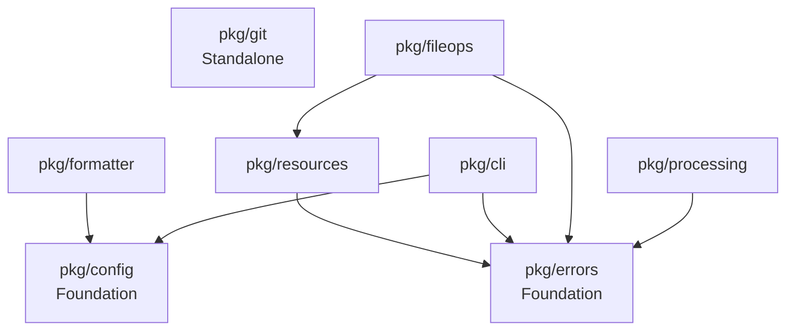

# EXTRACT-008: CLI Application Template - Remaining Subtasks Plan

## 🎯 Task Overview

**Task ID**: EXTRACT-008  
**Task Title**: Create CLI Application Template  
**Priority**: HIGH - Demonstrates value and accelerates adoption  
**Current Status**: Subtask 1 COMPLETED (20% complete), 4 subtasks remaining  
**Next Session Focus**: Subtasks 2-5 comprehensive implementation  

## 🚀 PHASE 1: CRITICAL VALIDATION COMPLETED

### ✅ Validation Results
- [x] **🛡️ Immutable Requirements Check**: No conflicts - remaining subtasks are additive ✅
- [x] **📋 Feature ID Verification**: EXTRACT-008 exists in feature-tracking.md ✅
- [x] **🔍 AI Assistant Compliance**: Token requirements and DOC-007/008 reviewed ✅
- [x] **⭐ AI Assistant Protocol**: Using MODIFICATION Protocol for extending existing feature ✅

### 📊 Current Progress Assessment
- **Subtask 1**: ✅ COMPLETED (2025-01-02) - CLI template application with all 8 packages
- **Subtask 2**: ✅ COMPLETED (2025-01-02) - Project scaffolding system with interactive generator
- **Subtask 3**: ⏳ Not Started - Integration documentation  
- **Subtask 4**: ⏳ Not Started - Migration guide
- **Subtask 5**: ⏳ Not Started - Package interdependency mapping

**Overall Progress**: 40% Complete (2/5 subtasks)

## 📝 Detailed Remaining Subtasks

### 2. 🛠️ Develop Project Scaffolding System
**Status**: [x] COMPLETED (2025-01-02)  
**Priority**: 🔺 HIGH  
**Actual Time**: 4 hours  
**Dependencies**: Subtask 1 (COMPLETED)  

#### 🎯 Objectives
Create an interactive generator that creates new CLI projects using selected extracted packages.

#### 📋 Implementation Plan

##### 2.1 Interactive Generator Core
- **File**: `cmd/scaffolding/main.go`
- **Purpose**: Main scaffolding application entry point
- **Features**:
  - Interactive CLI for project configuration
  - Component selection interface
  - Project template generation
  - Dependency management automation

##### 2.2 Component Selection System
- **File**: `cmd/scaffolding/internal/selector/`
- **Purpose**: Package selection and configuration
- **Components**:
  - Configuration management (pkg/config) ✅ Available
  - Error handling (pkg/errors + pkg/resources) ✅ Available  
  - Output formatting (pkg/formatter) ✅ Available
  - Git integration (pkg/git) ✅ Available
  - CLI framework (pkg/cli) ✅ Available
  - File operations (pkg/fileops) ✅ Available
  - Concurrent processing (pkg/processing) ✅ Available

##### 2.3 Project Templates
- **Templates**:
  - **Minimal**: Basic CLI with config and error handling
  - **Standard**: Adds formatting and Git integration  
  - **Advanced**: Full feature set with concurrent processing
  - **Custom**: User-selected components

##### 2.4 Generated Project Structure
```
generated-project/
├── main.go                 # Entry point using selected packages
├── cmd/                    # Command structure  
├── config/                 # Configuration templates
├── go.mod                  # Dependencies for selected packages
├── Makefile               # Build automation
├── README.md              # Generated documentation
└── .gitignore             # Standard Go gitignore
```

#### ✅ Success Criteria
- [x] Interactive component selection working ✅
- [x] Project templates generate correctly ✅
- [x] Generated projects build successfully ✅
- [x] Dependency management automated ✅
- [x] Multiple project types supported ✅

#### 🎯 Completion Summary
**Delivered Components:**
- Interactive CLI generator with promptui-based UI
- 4 project templates: minimal, standard, advanced, custom
- Complete file generation system with 16+ file types
- Package selection interface for all 8 extracted packages
- Build automation with comprehensive Makefile
- Generated projects include: main.go, commands, config, tests, documentation
- Validation system ensuring generated projects compile successfully

**Key Features Implemented:**
- Template-based file generation with Go text templates
- Package dependency management and go.mod generation
- Interactive configuration collection with validation
- Project structure visualization and progress reporting
- Comprehensive documentation and usage examples

#### 🔧 Implementation Tokens
```go
// 🔺 EXTRACT-008: Project scaffolding system - 🔧 Interactive generator core
// 🔺 EXTRACT-008: Component selection interface - 🔍 Package discovery and configuration
// 🔺 EXTRACT-008: Project template generation - 📝 Template processing and file creation
```

### 3. 📚 Create Integration Documentation
**Status**: [ ] Not Started  
**Priority**: 🔺 HIGH  
**Estimated Time**: 4-6 hours  
**Dependencies**: Subtask 1 (COMPLETED), Subtask 2 (for scaffolding examples)  

#### 🎯 Objectives
Comprehensive documentation showing how to use extracted packages individually and together.

#### 📋 Implementation Plan

##### 3.1 Integration Guide
- **File**: `docs/integration-guide.md`
- **Content**:
  - Package overview and capabilities  
  - Usage patterns and best practices
  - Integration examples with working code
  - Common pitfalls and solutions
  - Performance considerations

##### 3.2 Package Reference Documentation
- **File**: `docs/package-reference.md`  
- **Content**:
  - Individual package API documentation
  - Configuration options for each package
  - Error handling patterns
  - Interface definitions and contracts

##### 3.3 Tutorial Series
- **Directory**: `docs/tutorials/`
- **Files**:
  - `getting-started.md` - First CLI application
  - `advanced-patterns.md` - Complex integration scenarios
  - `performance-optimization.md` - Performance best practices
  - `troubleshooting.md` - Common issues and solutions

#### 📖 Content Areas

##### Individual Package Usage
- **pkg/config**: Schema-agnostic configuration loading examples
- **pkg/errors**: Structured error handling patterns  
- **pkg/resources**: Resource management and cleanup
- **pkg/formatter**: Template-based and printf formatting
- **pkg/git**: Repository detection and information extraction
- **pkg/cli**: Command patterns and framework usage
- **pkg/fileops**: Safe file operations and comparisons
- **pkg/processing**: Concurrent processing with worker pools

##### Integration Patterns
- Configuration-driven applications
- Error propagation across packages
- Resource cleanup coordination
- Output formatting consistency  
- Git-aware applications
- CLI command orchestration
- File operation safety
- Processing pipeline patterns

#### ✅ Success Criteria
- [ ] Comprehensive integration guide written
- [ ] Individual package documentation complete
- [ ] Tutorial series covers all major use cases
- [ ] Code examples tested and working
- [ ] Documentation follows established patterns

#### 🔧 Implementation Tokens
```go
// 🔺 EXTRACT-008: Integration documentation system - 📝 Comprehensive usage guides
// 🔺 EXTRACT-008: Package reference documentation - 📖 API and configuration reference
// 🔺 EXTRACT-008: Tutorial series creation - 📚 Step-by-step learning materials
```

### 4. 📖 Add Migration Guide
**Status**: [ ] Not Started  
**Priority**: 🔺 HIGH  
**Estimated Time**: 3-4 hours  
**Dependencies**: Subtask 3 (integration documentation)  

#### 🎯 Objectives
Step-by-step guide for migrating existing monolithic CLI applications to use extracted packages.

#### 📋 Implementation Plan

##### 4.1 Migration Methodology
- **File**: `docs/migration-guide.md`
- **Phases**:
  1. **Assessment Phase**: Analyze existing application
  2. **Planning Phase**: Design package integration strategy
  3. **Implementation Phase**: Gradual migration process
  4. **Validation Phase**: Ensure functionality preserved

##### 4.2 Assessment Tools and Checklists
- **Application Analysis Checklist**:
  - Configuration management patterns
  - Error handling approaches
  - File operation patterns
  - Output formatting methods
  - Git integration requirements
  - CLI command structure
  - Resource management needs
  - Processing patterns

##### 4.3 Migration Strategies
- **Gradual Migration**: Extract one package at a time (RECOMMENDED)
- **Parallel Development**: Develop new structure alongside existing
- **Big Bang Migration**: Complete restructure (NOT RECOMMENDED)
- **Hybrid Approach**: Combine strategies based on complexity

##### 4.4 Implementation Phases
1. **Foundation** (pkg/config, pkg/errors): Core infrastructure
2. **Services** (pkg/formatter, pkg/git): Domain-specific services  
3. **Framework** (pkg/cli): Command orchestration
4. **Operations** (pkg/fileops, pkg/processing): Business logic

#### 🔄 Migration Process Steps

##### Step 1: Assessment
- Inventory existing functionality
- Map to available packages
- Identify integration points
- Assess migration complexity

##### Step 2: Planning  
- Create extraction roadmap
- Design package boundaries
- Plan integration testing
- Define rollback procedures

##### Step 3: Implementation
- Extract packages incrementally
- Maintain parallel functionality
- Test at each integration point
- Document changes and decisions

##### Step 4: Validation
- Ensure feature parity
- Performance impact assessment
- Documentation updates
- User acceptance testing

#### ✅ Success Criteria
- [ ] Clear migration methodology documented
- [ ] Step-by-step process defined  
- [ ] Risk mitigation strategies included
- [ ] Validation approaches specified
- [ ] Examples from bkpdir migration provided

#### 🔧 Implementation Tokens
```go
// 🔺 EXTRACT-008: Migration methodology framework - 📖 Assessment and planning tools
// 🔺 EXTRACT-008: Migration strategy implementation - 🔧 Step-by-step migration process
// 🔺 EXTRACT-008: Migration validation system - 🛡️ Quality assurance and rollback
```

### 5. 🗺️ Create Package Interdependency Mapping
**Status**: [ ] Not Started  
**Priority**: 🔺 HIGH  
**Estimated Time**: 2-3 hours  
**Dependencies**: Subtasks 1-4 (for comprehensive examples)  

#### 🎯 Objectives
Visual and documented representation of how extracted packages relate and integrate.

#### 📋 Implementation Plan

##### 5.1 Dependency Analysis
- **Core Dependencies**:
  - pkg/config: No internal dependencies (foundation layer)
  - pkg/errors: No internal dependencies (foundation layer)
  - pkg/resources: Depends on pkg/errors
  - pkg/formatter: Depends on pkg/config
  - pkg/git: No internal dependencies (standalone)
  - pkg/cli: Depends on pkg/config, pkg/errors
  - pkg/fileops: Depends on pkg/errors, pkg/resources
  - pkg/processing: Depends on pkg/errors (for error handling)

##### 5.2 Usage Pattern Documentation
- **Foundation Layer**: pkg/config, pkg/errors (used by everything)
- **Resource Layer**: pkg/resources (builds on errors)  
- **Service Layer**: pkg/formatter, pkg/git (domain-specific)
- **Framework Layer**: pkg/cli (orchestration)
- **Operation Layer**: pkg/fileops, pkg/processing (business logic)

##### 5.3 Integration Pattern Matrix
| Package | pkg/config | pkg/errors | pkg/resources | pkg/formatter | pkg/git | pkg/cli | pkg/fileops | pkg/processing |
|---------|------------|------------|---------------|---------------|---------|---------|-------------|----------------|
| **Common Usage** | 95% | 90% | 70% | 80% | 60% | 95% | 85% | 40% |
| **Integration Complexity** | Low | Low | Medium | Medium | Low | Medium | High | High |
| **Standalone Capability** | High | High | Medium | Medium | High | Low | Medium | Medium |

##### 5.4 Visual Dependency Diagram


#### 📊 Deliverables

##### 5.1 Dependency Documentation
- **File**: `docs/package-dependencies.md`
- **Content**: Complete dependency analysis with rationale

##### 5.2 Usage Matrix  
- **File**: `docs/package-usage-matrix.md`
- **Content**: Which packages commonly work together

##### 5.3 Integration Examples
- **File**: `docs/integration-examples.md`
- **Content**: Common integration patterns with code examples

##### 5.4 Anti-patterns Documentation
- **File**: `docs/package-anti-patterns.md`
- **Content**: What to avoid when combining packages

#### ✅ Success Criteria
- [ ] Complete dependency analysis documented
- [ ] Visual dependency mapping created
- [ ] Common usage patterns identified  
- [ ] Integration guidelines provided
- [ ] Anti-patterns documented

#### 🔧 Implementation Tokens
```go
// 🔺 EXTRACT-008: Package dependency analysis - 🔍 Comprehensive dependency mapping
// 🔺 EXTRACT-008: Usage pattern documentation - 📊 Integration pattern analysis  
// 🔺 EXTRACT-008: Anti-pattern identification - 🛡️ Integration guidelines and warnings
```

## 🏗️ Implementation Strategy

### Phase 1: Scaffolding System (Priority 1)
**Timeline**: Days 1-2  
**Focus**: Create working project generator
1. Build interactive CLI for project configuration
2. Implement component selection system
3. Create project templates (minimal, standard, advanced)
4. Test generated project compilation

### Phase 2: Documentation Creation (Priority 2)  
**Timeline**: Days 3-4
**Focus**: Comprehensive integration guides
1. Write integration guide with examples
2. Create package reference documentation
3. Develop tutorial series
4. Test all documentation examples

### Phase 3: Migration Guide (Priority 3)
**Timeline**: Day 5
**Focus**: Migration methodology and tools
1. Document migration methodology
2. Create assessment tools and checklists
3. Define migration strategies
4. Provide bkpdir migration examples

### Phase 4: Dependency Mapping (Priority 4)
**Timeline**: Day 6
**Focus**: Package relationship analysis
1. Complete dependency analysis
2. Create visual dependency diagrams
3. Document usage patterns
4. Identify and document anti-patterns

### Phase 5: Integration and Polish (Priority 5)
**Timeline**: Day 7
**Focus**: Quality assurance and final integration
1. End-to-end testing of all components
2. Documentation review and cross-linking
3. Performance validation
4. Final polish and cleanup

## 🎯 Success Metrics

### Technical Metrics
- [ ] **Project Generator Functionality**: Scaffolding creates valid, buildable projects
- [ ] **Template Coverage**: Minimal, standard, advanced templates all working
- [ ] **Documentation Completeness**: All packages documented with examples
- [ ] **Code Examples Quality**: All examples tested and functional

### Documentation Metrics
- [ ] **Integration Guide**: Complete guide with working examples
- [ ] **Migration Guide**: Step-by-step process with risk mitigation
- [ ] **Tutorial Series**: Progressive learning materials
- [ ] **Dependency Mapping**: Clear visualization and documentation

### Adoption Metrics  
- [ ] **Scaffolding Usability**: Generator creates production-ready projects
- [ ] **Documentation Clarity**: Independent developers can follow guides
- [ ] **Migration Viability**: Existing projects can successfully migrate
- [ ] **Integration Ease**: Clear patterns for package combination

## 🔄 Risk Mitigation

### Technical Risks
- **Complex Dependencies**: Extensive testing of package combinations
- **Template Maintenance**: Automated validation of generated projects
- **Documentation Drift**: Automated testing of documentation examples

### Adoption Risks
- **Learning Curve**: Progressive tutorial series with examples
- **Integration Complexity**: Clear patterns and anti-pattern guidance
- **Migration Difficulty**: Incremental migration strategies

## 📁 Expected Deliverables

### Code Components (Subtask 2)
- `cmd/scaffolding/` - Complete project generator application
- Project templates (minimal, standard, advanced, custom)
- Template generation system
- Dependency management automation

### Documentation (Subtasks 3-5)
- `docs/integration-guide.md` - Comprehensive integration guide
- `docs/package-reference.md` - Complete package API reference
- `docs/tutorials/` - Tutorial series directory
- `docs/migration-guide.md` - Migration methodology and tools
- `docs/package-dependencies.md` - Dependency analysis
- `docs/package-usage-matrix.md` - Usage pattern matrix
- `docs/integration-examples.md` - Integration pattern examples
- `docs/package-anti-patterns.md` - Anti-pattern documentation

## 🏁 Definition of Done

### Subtask Completion Criteria
- [ ] **Subtask 2**: Working project generator with multiple templates
- [ ] **Subtask 3**: Complete integration documentation with tested examples
- [ ] **Subtask 4**: Migration guide with step-by-step methodology
- [ ] **Subtask 5**: Comprehensive package interdependency mapping

### Quality Gates
- [ ] All generated projects compile and run
- [ ] All documentation examples tested and verified
- [ ] Migration process validated with test cases
- [ ] Dependency mapping accurate and complete

### Documentation Updates
- [ ] Feature tracking status updated to "Completed"
- [ ] All subtasks marked complete in both locations
- [ ] Implementation tokens added to all code
- [ ] Context documentation updated as required

## 📝 Final Subtask: Documentation Updates

As required by the context documentation system, the final subtask will:

### 6. 📋 Update Task and Subtask Status
**Status**: [ ] Final Step  
**Priority**: 🔺 HIGH  
**Estimated Time**: 30 minutes  

#### 📋 Required Updates
1. **Feature Tracking Registry Updates**:
   - Update feature-tracking.md registry table with completion status
   - Update detailed subtask blocks with checkmarks [x]
   - Add completion notes for each subtask

2. **Cross-Reference Validation**:
   - Search for multiple locations of EXTRACT-008 in feature-tracking.md
   - Ensure consistency across all references
   - Update timeline and dependency information

3. **Notable Items Documentation**:
   - Document any architectural decisions made
   - Note any deviations from original plan
   - Record any new insights or patterns discovered
   - Update success metrics achieved

#### ✅ Success Criteria
- [ ] All subtasks marked complete in feature registry table
- [ ] All subtasks marked complete in detailed blocks  
- [ ] Cross-references updated consistently
- [ ] Notable items documented
- [ ] Completion summary created

---

**Created**: 2025-01-02  
**Task Progress**: 20% → Target 100%  
**Estimated Total Time**: 15-21 hours over 7 days  
**Next Session Focus**: Project Scaffolding System (Subtask 2)  
**Quality Target**: Production-ready template system with comprehensive documentation