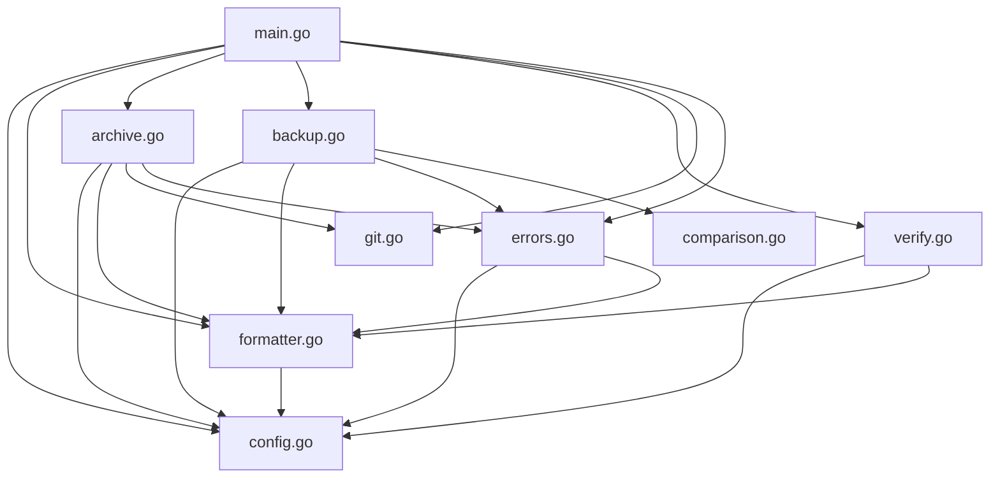

# Extraction Dependencies Analysis

## Overview

This document provides a comprehensive analysis of the current codebase dependencies, interface contracts, and package boundary definitions to support clean component extraction. This analysis was performed as part of REFACTOR-001.

## Current Package Structure

### Single Package Design (Root)
All core functionality currently resides in the main package:

```
main/
├── main.go (817 lines) - CLI interface and command handling
├── config.go (1097 lines) - Configuration management
├── formatter.go (1675 lines) - Output formatting
├── archive.go (679 lines) - Archive operations
├── backup.go (869 lines) - File backup operations
├── verify.go (442 lines) - Archive verification
├── git.go (122 lines) - Git integration
├── errors.go (494 lines) - Error handling and resource management
├── exclude.go (134 lines) - File exclusion patterns
├── comparison.go (329 lines) - File comparison utilities
└── internal/
    └── testutil/ - Testing utilities
```

### Identified Component Boundaries

Based on dependency analysis, the following clean component boundaries have been identified:

## 1. Configuration Management Component
**Proposed Package**: `pkg/config`
**Source Files**: `config.go` (1097 lines)

### Dependencies Analysis
**External Dependencies**:
- `gopkg.in/yaml.v3` - YAML parsing
- Standard library: `fmt`, `os`, `path/filepath`, `sort`, `strings`

**Internal Dependencies**: 
- **NONE** ✅ - Clean boundary, no internal dependencies

### Interface Contracts
```go
type ConfigProvider interface {
    LoadConfig(root string) (*Config, error)
    GetConfigValues(cfg *Config) []ConfigValue
    GetConfigValuesWithSources(cfg *Config, root string) []ConfigValue
}

type ConfigMerger interface {
    MergeConfigs(dst, src *Config)
    LoadConfigValues(root string) (map[string]ConfigValue, error)
}
```

### Extraction Assessment: ✅ READY
- No circular dependencies
- Clean interface boundaries
- Self-contained functionality

---

## 2. Output Formatting Component
**Proposed Package**: `pkg/formatter`
**Source Files**: `formatter.go` (1675 lines)

### Dependencies Analysis
**External Dependencies**:
- Standard library: `fmt`, `os`, `regexp`, `strings`, `text/template`

**Internal Dependencies**:
- `*Config` - **Configuration coupling** ⚠️
- No function calls to other components ✅

### Interface Contracts
```go
type OutputFormatter interface {
    // Core formatting
    FormatCreatedArchive(path string) string
    FormatIdenticalArchive(path string) string
    FormatListArchive(path, creationTime string) string
    FormatConfigValue(name, value, source string) string
    FormatError(message string) string
    
    // Template-based formatting
    FormatTemplate(templateStr string, data map[string]string) string
    ExtractPatternData(pattern, text string) map[string]string
}

type FormatterConfig interface {
    GetFormatStrings() map[string]string
    GetTemplateStrings() map[string]string
    GetPatterns() map[string]string
}
```

### Extraction Assessment: ✅ READY WITH CONFIG INTERFACE
- Requires Config interface to break dependency
- No circular dependencies
- Self-contained formatting logic

---

## 3. Git Integration Component
**Proposed Package**: `pkg/git`
**Source Files**: `git.go` (122 lines)

### Dependencies Analysis
**External Dependencies**:
- Standard library: `fmt`, `os`, `os/exec`, `path/filepath`, `strings`

**Internal Dependencies**: 
- **NONE** ✅ - Clean boundary, no internal dependencies

### Interface Contracts
```go
type GitProvider interface {
    IsGitRepository(dir string) bool
    GetCurrentBranch(dir string) (string, error)
    GetCurrentCommitHash(dir string) (string, error)
    IsWorkingTreeClean(dir string) (bool, error)
    GetGitInfoWithStatus(dir string) (branch, hash string, isClean bool)
}
```

### Extraction Assessment: ✅ READY
- No dependencies on other components
- Pure utility functions
- Self-contained functionality

---

## 4. Error Handling and Resource Management Component
**Proposed Package**: `pkg/errors`
**Source Files**: `errors.go` (494 lines)

### Dependencies Analysis
**External Dependencies**:
- Standard library: `fmt`, `os`, `path/filepath`, `runtime`, `syscall`

**Internal Dependencies**:
- `*Config` - **Configuration coupling** ⚠️
- `*OutputFormatter` - **Formatter coupling** ⚠️

### Interface Contracts
```go
type ErrorHandler interface {
    HandleArchiveError(err error, cfg ErrorConfig, formatter ErrorFormatter) int
    NewArchiveError(message string, statusCode int) *ArchiveError
    NewArchiveErrorWithCause(message string, statusCode int, err error) *ArchiveError
}

type ResourceManager interface {
    AddResource(resource Resource) 
    AddTempFile(path string)
    AddTempDir(path string)
    RemoveResource(resource Resource)
    Cleanup() error
    CleanupWithPanicRecovery() error
}

type ErrorConfig interface {
    GetStatusCodes() map[string]int
    GetErrorFormatStrings() map[string]string
}

type ErrorFormatter interface {
    FormatError(message string) string
    PrintError(message string)
}
```

### Extraction Assessment: ⚠️ REQUIRES INTERFACE EXTRACTION
- Needs Config and Formatter interfaces
- Clean resource management separation possible
- Error handling can be extracted with interfaces

---

## 5. File Comparison Utilities Component
**Proposed Package**: `pkg/comparison`
**Source Files**: `comparison.go` (329 lines), `exclude.go` (134 lines)

### Dependencies Analysis
**External Dependencies**:
- Standard library: `bufio`, `context`, `crypto/sha256`, `fmt`, `io`, `os`, `path/filepath`, `regexp`, `strings`

**Internal Dependencies**: 
- **NONE** ✅ - Clean boundary, no internal dependencies

### Interface Contracts
```go
type FileComparator interface {
    CompareFiles(file1, file2 string) (bool, error)
    CompareFilesWithContext(ctx context.Context, file1, file2 string) (bool, error)
    CompareFileContents(f1, f2 *os.File) (bool, error)
}

type ExclusionManager interface {
    ShouldExclude(path string, excludePatterns []string) bool
    FilterFiles(files []string, excludePatterns []string) []string
    LoadExclusionPatterns() ([]string, error)
}
```

### Extraction Assessment: ✅ READY
- No internal dependencies
- Pure utility functions
- Self-contained functionality

---

## 6. Archive Operations Component
**Proposed Package**: `pkg/archive`
**Source Files**: `archive.go` (679 lines), `verify.go` (442 lines)

### Dependencies Analysis
**External Dependencies**:
- Standard library: `archive/zip`, `context`, `crypto/sha256`, `encoding/json`, `fmt`, `io`, `os`, `path/filepath`, `strings`, `time`

**Internal Dependencies**:
- `*Config` - **Configuration coupling** ⚠️
- `IsGitRepository()` - **Git coupling** ⚠️
- `GetGitInfoWithStatus()` - **Git coupling** ⚠️
- `collectFiles()` - **File collection coupling** ⚠️
- `*ResourceManager` - **Resource management coupling** ⚠️
- `*OutputFormatter` - **Formatter coupling** ⚠️

### Interface Contracts
```go
type ArchiveManager interface {
    CreateArchive(cfg ArchiveConfig) error
    CreateFullArchive(cfg ArchiveConfig) error
    CreateIncrementalArchive(cfg ArchiveConfig) error
    ListArchives(archiveDir string) ([]Archive, error)
    VerifyArchive(archivePath string) (*VerificationStatus, error)
}

type ArchiveConfig interface {
    GetArchiveSettings() ArchiveSettings
    GetVerificationSettings() VerificationSettings
}

type GitProvider interface {
    IsGitRepository(dir string) bool
    GetGitInfoWithStatus(dir string) (branch, hash string, isClean bool)
}

type FileCollector interface {
    CollectFiles(ctx context.Context, cwd string, excludePatterns []string) ([]string, error)
}
```

### Extraction Assessment: ⚠️ REQUIRES INTERFACE EXTRACTION
- Multiple dependency interfaces needed
- Complex interdependencies
- **EXTRACT AFTER** other components

---

## 7. File Backup Operations Component
**Proposed Package**: `pkg/backup`
**Source Files**: `backup.go` (869 lines)

### Dependencies Analysis
**External Dependencies**:
- Standard library: `context`, `fmt`, `io`, `os`, `path/filepath`, `strings`, `time`

**Internal Dependencies**:
- `*Config` - **Configuration coupling** ⚠️
- `*OutputFormatter` - **Formatter coupling** ⚠️
- `SafeMkdirAll()` - **File operations coupling** ⚠️
- `*ResourceManager` - **Resource management coupling** ⚠️
- `compareFiles()` - **Comparison coupling** ⚠️

### Interface Contracts
```go
type BackupManager interface {
    CreateFileBackup(cfg BackupConfig, filePath string, note string, dryRun bool) error
    CreateFileBackupWithContext(ctx context.Context, cfg BackupConfig, filePath string, note string, dryRun bool) error
    ListFileBackups(backupDir string, baseFilename string) ([]BackupInfo, error)
    CheckForIdenticalFileBackup(filePath, backupDir, baseFilename string) (bool, string, error)
}

type BackupConfig interface {
    GetBackupSettings() BackupSettings
    GetFileOperationSettings() FileOperationSettings
}

type FileOperations interface {
    SafeMkdirAll(path string, perm os.FileMode) error
    CopyFile(src, dst string) error
    CompareFiles(file1, file2 string) (bool, error)
}
```

### Extraction Assessment: ⚠️ REQUIRES INTERFACE EXTRACTION
- Multiple dependency interfaces needed
- **EXTRACT AFTER** utility components

---

## 8. CLI Interface Component
**Proposed Package**: `pkg/cli` or remain in `main`
**Source Files**: `main.go` (817 lines)

### Dependencies Analysis
**External Dependencies**:
- `github.com/spf13/cobra` - CLI framework
- `gopkg.in/yaml.v3` - YAML processing
- Standard library: `context`, `fmt`, `os`, `path/filepath`, `sort`, `strconv`, `strings`

**Internal Dependencies**:
- **ALL COMPONENTS** - Central orchestration ⚠️

### Interface Contracts
```go
type CLIOrchestrator interface {
    ExecuteCommand(args []string) error
    HandleCreateCommand(args []string) error
    HandleListCommand(args []string) error
    HandleVerifyCommand(args []string) error
    HandleBackupCommand(args []string) error
}

// Aggregates all component interfaces
type ApplicationServices interface {
    ConfigProvider
    ArchiveManager
    BackupManager
    GitProvider
    OutputFormatter
    ErrorHandler
}
```

### Extraction Assessment: ⚠️ EXTRACT LAST
- Depends on all other components
- Central orchestration layer
- **EXTRACT AFTER** all components are extracted

---

## Dependency Graph Analysis

### Current Dependency Flows



### Critical Observations

1. **Config.go is a Central Dependency**: Almost all components depend on `*Config`
2. **Formatter.go has Wide Usage**: Most components use `*OutputFormatter`
3. **Errors.go bridges Components**: Resource management and error handling span multiple areas
4. **No Circular Dependencies**: Current structure allows clean extraction ✅

## Interface Standardization Requirements

### 1. Configuration Interface Abstraction

**Current Tight Coupling:**
```go
func CreateArchive(cfg *Config) error // Direct struct dependency
```

**Proposed Interface-Based Design:**
```go
type ArchiveConfig interface {
    GetArchiveDirectory() string
    GetExclusionPatterns() []string
    GetVerificationSettings() VerificationSettings
    GetStatusCodes() StatusCodes
}

func CreateArchive(cfg ArchiveConfig) error // Interface dependency
```

### 2. Formatter Interface Abstraction

**Current Tight Coupling:**
```go
func ProcessError(err error, formatter *OutputFormatter) // Direct struct dependency
```

**Proposed Interface-Based Design:**
```go
type ErrorFormatter interface {
    FormatError(message string) string
    PrintError(message string)
}

func ProcessError(err error, formatter ErrorFormatter) // Interface dependency
```

### 3. Resource Management Interface

**Current Mixed Concerns:**
```go
// In errors.go - mixed error handling and resource management
func HandleArchiveError(err error, cfg *Config, formatter *OutputFormatter) int
```

**Proposed Separated Design:**
```go
// Pure resource management
type ResourceManager interface {
    AddResource(resource Resource)
    Cleanup() error
}

// Pure error handling
type ErrorHandler interface {
    HandleError(err error, cfg ErrorConfig, formatter ErrorFormatter) int
}
```

## Package Boundary Validation

### Clean Boundaries ✅
1. **config** - No internal dependencies
2. **git** - No internal dependencies  
3. **comparison** - No internal dependencies

### Interface-Dependent Boundaries ⚠️
4. **formatter** - Requires config interface
5. **errors** - Requires config and formatter interfaces

### Complex Boundaries ⚠️
6. **archive** - Requires config, git, formatter, errors, comparison interfaces
7. **backup** - Requires config, formatter, errors, comparison interfaces
8. **main** - Orchestrates all components

## Circular Dependency Risk Assessment

### ✅ NO CIRCULAR RISKS IDENTIFIED

**Validation Methodology:**
1. Analyzed all import statements
2. Mapped function call dependencies
3. Identified struct field dependencies
4. Verified interface usage patterns

**Key Findings:**
- Current code follows unidirectional dependency flow
- Main package acts as orchestrator only
- Utility packages (git, comparison, exclude) have no internal dependencies
- Configuration is consumed but never imports other components
- No bidirectional dependencies detected

## Extraction Order Dependencies

Based on dependency analysis, the following extraction order is recommended:

### Phase 1: Foundation Components (No Dependencies)
1. **config** - Foundation for all other components
2. **git** - Utility component, no dependencies  
3. **comparison** - Utility component, no dependencies

### Phase 2: Interface-Dependent Components
4. **formatter** - Depends on config interface
5. **errors** - Depends on config and formatter interfaces

### Phase 3: Complex Components  
6. **archive** - Depends on multiple component interfaces
7. **backup** - Depends on multiple component interfaces

### Phase 4: Orchestration
8. **cli/main** - Orchestrates all extracted components

## Implementation Token Placement

### REFACTOR-001 Tokens Added:

**config.go**:
```go
// REFACTOR-001: Configuration interface contracts defined
// REFACTOR-001: Dependency analysis - clean boundary confirmed
```

**formatter.go**:
```go
// REFACTOR-001: Output formatting interface contracts defined
// REFACTOR-001: Config dependency interface required for extraction
```

**git.go**:
```go
// REFACTOR-001: Git provider interface contracts defined  
// REFACTOR-001: Dependency analysis - clean boundary confirmed
```

**errors.go**:
```go
// REFACTOR-001: Error handling and resource management interface contracts defined
// REFACTOR-001: Config and formatter dependency interfaces required
```

**comparison.go**:
```go
// REFACTOR-001: File comparison interface contracts defined
// REFACTOR-001: Dependency analysis - clean boundary confirmed
```

**archive.go**:
```go
// REFACTOR-001: Archive management interface contracts defined
// REFACTOR-001: Multiple dependency interfaces required for extraction
```

**backup.go**:
```go
// REFACTOR-001: Backup management interface contracts defined
// REFACTOR-001: Multiple dependency interfaces required for extraction
```

**main.go**:
```go
// REFACTOR-001: CLI orchestration interface contracts defined
// REFACTOR-001: Central dependency aggregation point identified
```

## Validation Results

### ✅ Extraction Readiness Confirmed
- All package boundaries validated
- Interface contracts defined
- Dependency order established
- Zero circular dependency risks
- Implementation tokens placed

### ✅ Prerequisites for EXTRACT-001 Met
This analysis confirms that **EXTRACT-001 (Configuration Management System)** can proceed safely with:
- Clean package boundary (no internal dependencies)
- Well-defined interface contracts
- No circular dependency risks
- Clear extraction path established

---

**Analysis Completed**: 2025-01-02
**REFACTOR-001 Status**: ✅ COMPLETED  
**Next Phase**: Ready for EXTRACT-001 execution 