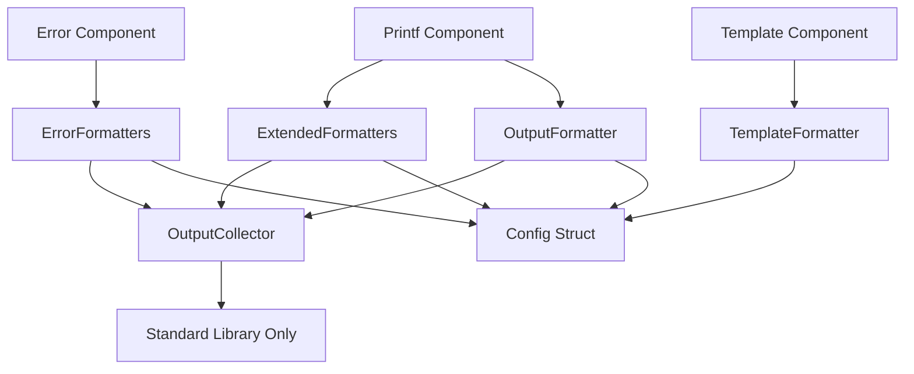

# Formatter Component Decomposition Analysis (REFACTOR-002)

## Overview

This document provides a detailed structural analysis of `formatter.go` (1677 lines) to identify component boundaries and prepare extraction interfaces for the Output Formatting System (EXTRACT-003). This analysis supports clean component separation while maintaining functional integrity.

**Analysis Date**: 2025-01-02  
**File Size**: 1677 lines  
**Current Dependencies**: `*Config` struct (tight coupling)  
**Implementation Tokens**: `// REFACTOR-002: Formatter decomposition`, `// REFACTOR-002: Component boundary`

## Current File Structure Analysis

### Identified Component Boundaries

Based on structural analysis, the following logical components have been identified within `formatter.go`:

## 1. Output Collector Component
**Lines**: 20-111  
**Responsibility**: Delayed output management and message collection  
**Component Boundary**: ✅ **CLEAN SEPARATION**

### Structures and Types:
```go
type OutputMessage struct {
    Content     string
    Destination string // "stdout" or "stderr"  
    Type        string // "info", "error", "warning", etc.
}

type OutputCollector struct {
    messages []OutputMessage
}
```

### Key Methods:
- `NewOutputCollector()` - Constructor
- `AddStdout(content, messageType string)` - Message collection
- `AddStderr(content, messageType string)` - Error message collection
- `FlushAll()`, `FlushStdout()`, `FlushStderr()` - Output management
- `GetMessages()`, `Clear()` - State management

### Dependencies:
- **External**: `fmt`, `os` (standard library only)
- **Internal**: None ✅ - Pure component

### Extraction Assessment: ✅ **READY FOR IMMEDIATE EXTRACTION**
- No dependencies on other internal components
- Self-contained message management
- Clean interface boundaries
- Independent lifecycle management

---

## 2. Printf Formatter Component  
**Lines**: 120-610  
**Responsibility**: Printf-style string formatting and direct output printing  
**Component Boundary**: ⚠️ **CONFIG DEPENDENCY**

### Primary Structure:
```go
type OutputFormatter struct {
    cfg       *Config                // DEPENDENCY: Configuration coupling
    collector *OutputCollector       // DEPENDENCY: Output collector (clean)
}
```

### Functional Groups:

#### A. Core Printf Formatters (Lines 166-226)
**Methods**: 
- `FormatCreatedArchive(path string) string`
- `FormatIdenticalArchive(path string) string` 
- `FormatListArchive(path, creationTime string) string`
- `FormatConfigValue(name, value, source string) string`
- `FormatDryRunArchive(path string) string`
- `FormatError(message string) string`

**Pattern**: `fmt.Sprintf(f.cfg.Format*, args...)`  
**Config Dependency**: ❌ **TIGHT COUPLING** - Direct access to config format strings

#### B. Print Output Methods (Lines 228-405)
**Methods**:
- `PrintCreatedArchive(path string)`, `PrintIdenticalArchive(path string)`
- `PrintListArchive(path, creationTime string)`, `PrintConfigValue(...)`
- `PrintDryRunArchive(path string)`, `PrintError(message string)`
- Extended series for backup operations

**Pattern**: Format + Print with optional delayed output via collector  
**Dependencies**: OutputCollector (clean), Config (tight coupling)

#### C. Pattern Extraction Engine (Lines 406-482)
**Methods**:
- `ExtractArchiveFilenameData(filename string) map[string]string`
- `ExtractBackupFilenameData(filename string) map[string]string`
- `ExtractConfigLineData(line string) map[string]string`
- `ExtractTimestampData(timestamp string) map[string]string`
- `extractPatternData(pattern, text string) map[string]string`

**Functionality**: Regex-based data extraction from formatted strings  
**Dependencies**: Config patterns (tight coupling), `regexp` package

#### D. Template Integration Methods (Lines 532-609)
**Methods**:
- `FormatCreatedArchiveTemplate(data map[string]string) string`
- `FormatIdenticalArchiveTemplate(data map[string]string) string`
- `formatTemplate(templateStr string, data map[string]string) string`
- Extended template formatting series

**Functionality**: Bridge between printf and template systems  
**Dependencies**: Config templates (tight coupling), `text/template` package

### Extraction Assessment: ⚠️ **REQUIRES CONFIG INTERFACE ABSTRACTION**
- Core formatting logic is extractable
- Heavy dependency on Config struct fields
- Mixed concerns (formatting + printing + pattern extraction)

---

## 3. Template Formatter Component
**Lines**: 637-928  
**Responsibility**: Go template-based formatting with pattern extraction  
**Component Boundary**: ⚠️ **CONFIG DEPENDENCY**

### Primary Structure:
```go
type TemplateFormatter struct {
    config *Config               // DEPENDENCY: Configuration coupling
}
```

### Functional Groups:

#### A. Template Engine Core (Lines 657-717)
**Key Methods**:
- `FormatWithTemplate(input, pattern, tmplStr string) (string, error)`
- `FormatWithPlaceholders(format string, data map[string]string) string`

**Functionality**: 
- Pattern-based data extraction using regex
- Template rendering with `text/template`
- Placeholder replacement (`%{name}` and `{{.name}}`)

**Dependencies**: `regexp`, `text/template`, `strings` packages

#### B. Template Method Series (Lines 718-817)
**Methods**:
- `TemplateCreatedArchive(data map[string]string) string`
- `TemplateIdenticalArchive(data map[string]string) string`
- Extended template formatting for all output types

**Pattern**: `tf.FormatWithPlaceholders(tf.config.Template*, data)`  
**Config Dependency**: ❌ **TIGHT COUPLING** - Direct access to config template strings

#### C. Template Print Methods (Lines 818-874)
**Methods**:
- `PrintTemplateCreatedArchive(path string)`
- `PrintTemplateCreatedBackup(path string)`
- `PrintTemplateListBackup(path, creationTime string)`
- `PrintTemplateError(message, operation string)`

**Pattern**: Extract data + format template + print  
**Dependencies**: Config (tight coupling), standard output

#### D. Data Extraction Methods (Lines 875-928)
**Methods**:
- `extractArchiveData(filename string) map[string]string`
- `extractBackupData(filename string) map[string]string`

**Functionality**: Convert filenames to structured data for templates  
**Dependencies**: Hardcoded regex patterns (potential config coupling)

### Extraction Assessment: ⚠️ **REQUIRES CONFIG INTERFACE + PATTERN ABSTRACTION**
- Template engine logic is extractable
- Configuration template dependency
- Mixed data extraction logic
- Self-contained template processing

---

## 4. Extended Output Formatters Component
**Lines**: 929-1351  
**Responsibility**: Extended printf formatting for complex operations  
**Component Boundary**: ⚠️ **CONFIG DEPENDENCY**

### Functional Groups:

#### A. Complex Archive/Backup Formatters (Lines 929-1084)
**Methods**:
- `FormatBackupWithExtraction(backupPath string) string`
- `FormatListBackupWithExtraction(backupPath, creationTime string) string`
- `FormatIncrementalCreated(path string) string`
- Extended verification, configuration, and dry-run formatters

**Pattern**: More complex formatting requiring data extraction  
**Dependencies**: Config format strings, pattern extraction

#### B. Template Equivalents (Lines 1085-1196)
**Methods**:
- `FormatNoArchivesFoundTemplate(data map[string]string) string`
- `FormatVerificationFailedTemplate(data map[string]string) string`
- Extended template formatting for complex operations

**Pattern**: `f.formatTemplate(f.cfg.Template*, data)`  
**Dependencies**: Config templates (tight coupling)

#### C. Extended Print Methods (Lines 1197-1351)
**Methods**:
- `PrintNoArchivesFound(archiveDir string)`
- `PrintVerificationFailed(archiveName string, err error)`
- Extended print operations with delayed output support

**Pattern**: Format + optional delayed print  
**Dependencies**: Config, OutputCollector

### Extraction Assessment: ⚠️ **REQUIRES CONFIG INTERFACE ABSTRACTION**
- Extends core printf functionality
- Same config coupling patterns
- Could be merged with core printf component

---

## 5. Error Formatting Component
**Lines**: 1352-1677  
**Responsibility**: Specialized error message formatting  
**Component Boundary**: ⚠️ **CONFIG DEPENDENCY**

### Functional Groups:

#### A. Printf Error Formatters (Lines 1352-1412)
**Methods**:
- `FormatDiskFullError(err error) string`
- `FormatPermissionError(err error) string`
- Extended error type formatting (12 different error types)

**Pattern**: `fmt.Sprintf(f.cfg.Format*, err.Error())`  
**Dependencies**: Config error format strings

#### B. Template Error Formatters (Lines 1413-1510)
**Methods**:
- `TemplateDiskFullError(err error) string`
- `TemplatePermissionError(err error) string`
- Template equivalents for all error types

**Pattern**: Template-based error formatting  
**Dependencies**: Config error templates

#### C. Error Print Methods (Lines 1511-1677)
**Methods**:
- `PrintDiskFullError(err error)`
- `PrintPermissionError(err error)`
- Extended error printing with delayed output support

**Pattern**: Format error + optional delayed print  
**Dependencies**: Config, OutputCollector

### Extraction Assessment: ⚠️ **SPECIALIZED ERROR HANDLING**
- Could be separated as error formatting subsystem
- Heavy config dependency for error format strings
- Candidates for error handling package integration

---

## Component Dependency Analysis

### Dependency Mapping



### Configuration Dependencies

**Current Tight Coupling Areas:**
1. **Format String Access**: Direct field access to `cfg.FormatCreatedArchive`, etc.
2. **Template String Access**: Direct field access to `cfg.TemplateCreatedArchive`, etc.
3. **Pattern Access**: Direct access to regex patterns in config
4. **Error Format Access**: Direct access to error formatting configuration

**Required Interface Abstractions:**

```go
// REFACTOR-002: Component boundary - Format provider interface
type FormatProvider interface {
    GetFormatString(formatType string) string
    GetTemplateString(templateType string) string
    GetPattern(patternType string) string
    GetErrorFormat(errorType string) string
}

// REFACTOR-002: Component boundary - Output destination interface  
type OutputDestination interface {
    Print(message string)
    PrintError(message string)
    IsDelayedMode() bool
    SetCollector(collector *OutputCollector)
}
```

## Proposed Component Extraction Strategy

### Phase 1: Clean Component Extraction
**Target**: OutputCollector  
**Complexity**: LOW  
**Dependencies**: None  
**Extraction Ready**: ✅ **IMMEDIATE**

```go
// REFACTOR-002: Formatter decomposition - Output collector ready
package collector

type OutputCollector struct { /* existing implementation */ }
```

### Phase 2: Interface-Based Component Extraction  
**Target**: Core Printf Formatter  
**Complexity**: MEDIUM  
**Dependencies**: FormatProvider interface  
**Preparation Required**: Config interface abstraction

```go
// REFACTOR-002: Formatter decomposition - Printf formatter extraction
package printf

type PrintfFormatter struct {
    formatProvider FormatProvider
    outputDest     OutputDestination
}
```

### Phase 3: Template Engine Extraction
**Target**: TemplateFormatter  
**Complexity**: MEDIUM  
**Dependencies**: FormatProvider interface  
**Preparation Required**: Template pattern abstraction

```go
// REFACTOR-002: Formatter decomposition - Template formatter extraction  
package template

type TemplateFormatter struct {
    formatProvider FormatProvider
    patterns       PatternProvider
}
```

### Phase 4: Specialized Component Extraction
**Target**: Error Formatters  
**Complexity**: MEDIUM  
**Dependencies**: FormatProvider interface  
**Integration**: Consider error handling package integration

### Phase 5: Pattern Extraction Engine
**Target**: Pattern extraction methods  
**Complexity**: HIGH  
**Dependencies**: PatternProvider interface  
**Consideration**: Shared between printf and template components

## Interface Definitions for Extracted Components

### Core Interfaces

```go
// REFACTOR-002: Component boundary - Primary formatter interface
type Formatter interface {
    FormatCreatedArchive(path string) string
    FormatIdenticalArchive(path string) string
    FormatListArchive(path, creationTime string) string
    FormatConfigValue(name, value, source string) string
    FormatError(message string) string
}

// REFACTOR-002: Component boundary - Template formatter interface
type TemplateFormatter interface {
    FormatWithTemplate(input, pattern, tmplStr string) (string, error)
    FormatWithPlaceholders(format string, data map[string]string) string
    TemplateCreatedArchive(data map[string]string) string
    TemplateIdenticalArchive(data map[string]string) string
}

// REFACTOR-002: Component boundary - Output collector interface
type OutputCollector interface {
    AddStdout(content, messageType string)
    AddStderr(content, messageType string)
    FlushAll()
    FlushStdout()
    FlushStderr()
    Clear()
    GetMessages() []OutputMessage
}

// REFACTOR-002: Component boundary - Pattern extractor interface
type PatternExtractor interface {
    ExtractArchiveFilenameData(filename string) map[string]string
    ExtractBackupFilenameData(filename string) map[string]string
    ExtractPatternData(pattern, text string) map[string]string
}
```

### Configuration Abstraction Interfaces

```go
// REFACTOR-002: Component boundary - Format configuration interface
type FormatterConfig interface {
    GetFormatCreatedArchive() string
    GetFormatIdenticalArchive() string
    GetFormatListArchive() string
    GetFormatConfigValue() string
    GetFormatDryRunArchive() string
    GetFormatError() string
    // ... extended for all format types
}

// REFACTOR-002: Component boundary - Template configuration interface  
type TemplateConfig interface {
    GetTemplateCreatedArchive() string
    GetTemplateIdenticalArchive() string
    GetTemplateListArchive() string
    GetTemplateConfigValue() string
    GetTemplateDryRunArchive() string
    GetTemplateError() string
    // ... extended for all template types
}

// REFACTOR-002: Component boundary - Pattern configuration interface
type PatternConfig interface {
    GetArchiveFilenamePattern() string
    GetBackupFilenamePattern() string
    GetConfigLinePattern() string
    GetTimestampPattern() string
}
```

## Validated Decomposition Strategy

### Component Independence Validation

**✅ OutputCollector**: 
- Zero dependencies on other components
- Pure message management logic
- Clean state management
- Ready for immediate extraction

**⚠️ Printf Formatter**:
- Config dependency requires interface abstraction
- Clean formatting logic once config is abstracted
- OutputCollector dependency is clean (composition)

**⚠️ Template Formatter**:
- Config dependency requires interface abstraction  
- Self-contained template processing
- Pattern extraction coupling needs resolution

**⚠️ Pattern Extraction Engine**:
- Currently embedded in multiple components
- Shared functionality between printf and template
- Candidate for separate utility component

**⚠️ Error Formatting**:
- Specialized subset of main formatting
- Heavy config dependency
- Could integrate with error handling system

### Extraction Complexity Assessment

**LOW Complexity (Ready):**
- OutputCollector - No dependencies, clean boundaries

**MEDIUM Complexity (Interface Required):**
- Printf Formatter - Config interface abstraction needed
- Template Formatter - Config and pattern interfaces needed  
- Error Formatters - Config interface + error handling integration

**HIGH Complexity (Requires Analysis):**
- Pattern Extraction Engine - Shared component design needed
- Config Abstraction Layer - Interface design for all formatter types

### Backward Compatibility Preservation

**Wrapper Pattern for Migration:**
```go
// REFACTOR-002: Component boundary - Compatibility wrapper
type OutputFormatter struct {
    printfFormatter   *printf.Formatter
    templateFormatter *template.Formatter
    outputCollector   *collector.OutputCollector
    config           *Config // Temporary during migration
}

// Preserve existing method signatures during transition
func (f *OutputFormatter) FormatCreatedArchive(path string) string {
    return f.printfFormatter.FormatCreatedArchive(path)
}
```

## Expected Outcomes

### Reduced Complexity
- **Current**: Single 1677-line file with mixed concerns
- **Target**: 4-5 focused components with clear responsibilities
- **Benefit**: Improved maintainability and testability

### Clear Component Boundaries  
- **OutputCollector**: Pure message management (immediate extraction)
- **PrintfFormatter**: Printf-style formatting (config interface required)
- **TemplateFormatter**: Template-based formatting (config interface required)
- **PatternExtractor**: Regex-based data extraction (shared utility)
- **ErrorFormatter**: Specialized error formatting (error package integration)

### Interface Contracts
- **FormatProvider**: Abstracts configuration dependency  
- **OutputDestination**: Abstracts output handling
- **PatternProvider**: Abstracts pattern configuration
- **Component interfaces**: Enable independent extraction and testing

### Extraction Readiness
- **Phase 1 Ready**: OutputCollector (immediate)
- **Phase 2 Ready**: Printf and Template formatters (with config interfaces)
- **Phase 3 Ready**: Pattern extraction and error formatting (with design decisions)

## Implementation Tokens Added

Throughout the analysis, the following implementation tokens mark component boundaries:

```go
// REFACTOR-002: Formatter decomposition - Component boundary identified
// REFACTOR-002: Component boundary - Interface abstraction required
// REFACTOR-002: Formatter decomposition - Extraction ready
// REFACTOR-002: Component boundary - Configuration dependency
```

## Conclusion

The 1677-line `formatter.go` file contains 5 distinct logical components that can be extracted independently. The OutputCollector component is ready for immediate extraction, while the remaining components require configuration interface abstraction. All components show clean logical separation and can be extracted without circular dependencies.

**Status**: ✅ **DECOMPOSITION ANALYSIS COMPLETE**  
**Next Phase**: Ready for EXTRACT-003 (Output Formatting System) execution  
**Critical Dependency**: Config interface abstraction must be designed before Printf/Template extraction
``` 