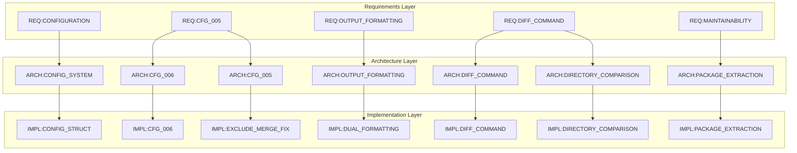
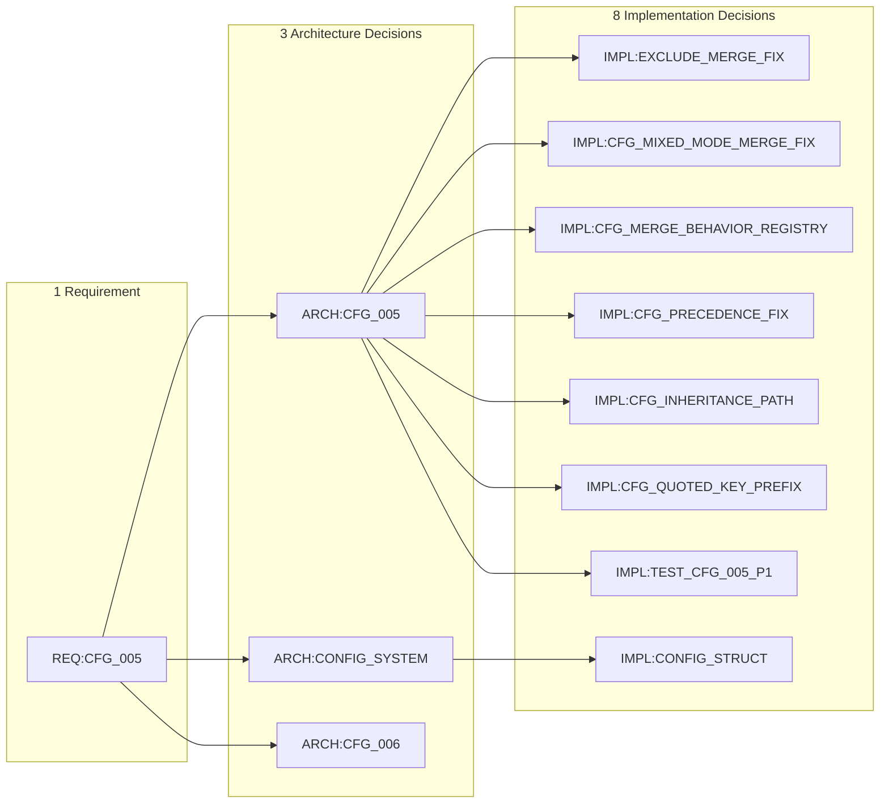
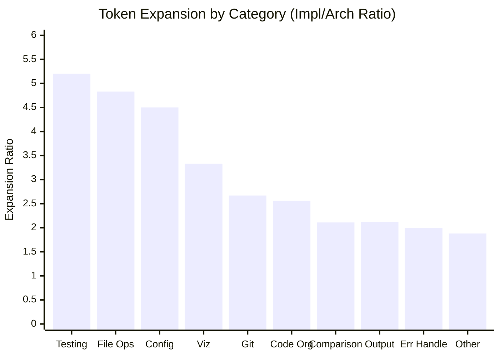
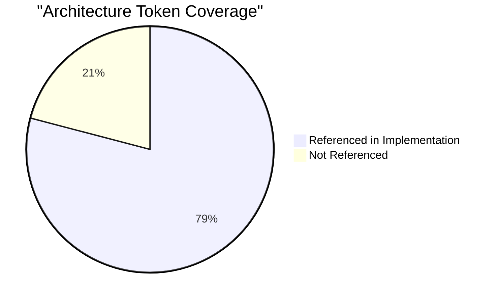
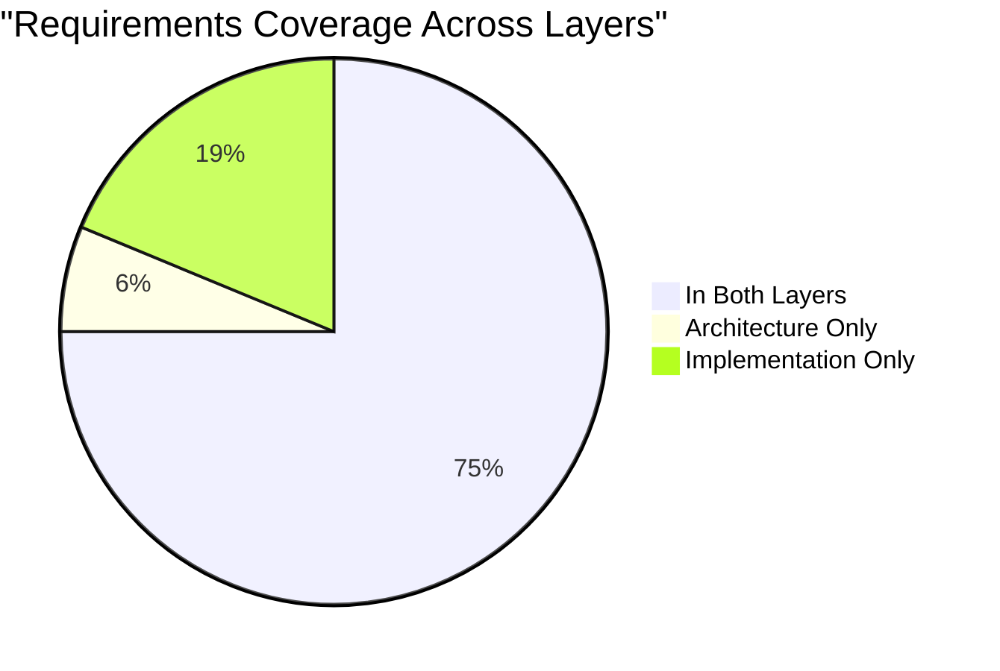
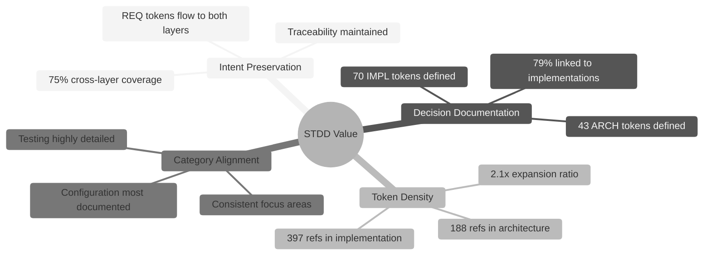

# STDD Architecture vs Implementation Comparison Analysis

**Generated**: Automated analysis of semantic token usage across STDD documentation layers.

[REQ:STDD_VIS] [ARCH:STDD_VIS_FLOW] [IMPL:STDD_VIS_ASSETS]

## Executive Summary

This analysis demonstrates how the Semantic Token-Driven Development (STDD) methodology
preserves intent from architecture decisions through implementation decisions.

| Metric | Architecture Decisions | Implementation Decisions |
|--------|----------------------|-------------------------|
| Total Lines | 1,376 | 3,147 |
| Total Token References | 188 | 397 |
| Unique REQ References | 26 | 30 |
| Unique ARCH Tokens | 43 | 34 |
| Unique IMPL Tokens | 2 | 70 |
| Number of Sections | 39 | 50 |

## Traceability Metrics

| Metric | Value |
|--------|-------|
| Architecture tokens referenced in implementation | 34/43 (79.1%) |
| Requirements covered by both layers | 24/32 (75.0%) |
| Implementation tokens defined | 70 |
| Architecture tokens without implementation reference | 12 |

## Category Distribution

Comparison of token usage by conceptual category:

```
Category                  |  Architecture  |  Implementation 
------------------------------------------------------------
Configuration             | ████           | ████████████████████
Documentation             | ███            | ████            
Output/Formatting         | ██             | ████            
Other                     | ██             | ███             
File Operations           |                | ███             
Code Organization         | █              | ███             
Testing                   |                | ███             
CLI/UX                    | ██             | █               
Comparison                | █              | ██              
Resource Management       | █              | █               
Performance               | █              |                 
Visualization             |                | █               
Git Integration           |                | █               
Security                  | █              |                 
Error Handling            |                |                 
Build/Deployment          |                |                 
```

### Category Details

| Category | Architecture | Implementation | Ratio (Impl/Arch) |
|----------|--------------|----------------|-------------------|
| Configuration | 34 | 153 | 4.5x |
| Documentation | 27 | 31 | 1.15x |
| Output/Formatting | 16 | 34 | 2.12x |
| Other | 16 | 30 | 1.88x |
| File Operations | 6 | 29 | 4.83x |
| Code Organization | 9 | 23 | 2.56x |
| Testing | 5 | 26 | 5.2x |
| CLI/UX | 22 | 8 | 0.36x |
| Comparison | 9 | 19 | 2.11x |
| Resource Management | 8 | 14 | 1.75x |
| Performance | 14 | 5 | 0.36x |
| Visualization | 3 | 10 | 3.33x |
| Git Integration | 3 | 8 | 2.67x |
| Security | 10 | 1 | 0.1x |
| Error Handling | 3 | 6 | 2.0x |
| Build/Deployment | 3 | 0 | 0.0x |

## Top Referenced Tokens

### Top Requirements in Architecture Decisions

| Rank | Token | References |
|------|-------|------------|
| 1 | `[REQ:MAINTAINABILITY]` | 17 |
| 2 | `[REQ:USABILITY]` | 17 |
| 3 | `[REQ:PERFORMANCE]` | 11 |
| 4 | `[REQ:CONFIGURATION]` | 10 |
| 5 | `[REQ:RELIABILITY]` | 9 |
| 6 | `[REQ:OUTPUT_FORMATTING]` | 8 |
| 7 | `[REQ:CFG_005]` | 4 |
| 8 | `[REQ:CFG_006]` | 4 |
| 9 | `[REQ:CODE_QUALITY]` | 4 |
| 10 | `[REQ:DOC_016]` | 4 |
| 11 | `[REQ:RESOURCE_MANAGEMENT]` | 4 |
| 12 | `[REQ:CONFIG_OUTPUT_GROUPING]` | 3 |
| 13 | `[REQ:DIFF_COMMAND]` | 3 |
| 14 | `[REQ:GOV_REGISTRY_COMPLETENESS]` | 3 |
| 15 | `[REQ:INCREMENTAL_DUPLICATE_PREVENTION]` | 3 |

### Top Requirements in Implementation Decisions

| Rank | Token | References |
|------|-------|------------|
| 1 | `[REQ:CONFIGURATION]` | 39 |
| 2 | `[REQ:CFG_005]` | 29 |
| 3 | `[REQ:CFG_001]` | 15 |
| 4 | `[REQ:MAINTAINABILITY]` | 12 |
| 5 | `[REQ:OUTPUT_FORMATTING]` | 9 |
| 6 | `[REQ:CFG_006]` | 5 |
| 7 | `[REQ:OUT_002]` | 5 |
| 8 | `[REQ:CUSTOMIZABLE_FORMAT_STRINGS]` | 4 |
| 9 | `[REQ:DIFF_COMMAND]` | 4 |
| 10 | `[REQ:DOC_016]` | 4 |
| 11 | `[REQ:FILE_BACKUP]` | 4 |
| 12 | `[REQ:LIST_LIMIT]` | 4 |
| 13 | `[REQ:STDD_VIS]` | 4 |
| 14 | `[REQ:GIT_INTEGRATION]` | 3 |
| 15 | `[REQ:INCREMENTAL_DUPLICATE_PREVENTION]` | 3 |

### Top Architecture Tokens (Defined)

| Rank | Token | References |
|------|-------|------------|
| 1 | `[ARCH:CFG_006]` | 4 |
| 2 | `[ARCH:TOKEN_SYSTEM]` | 4 |
| 3 | `[ARCH:CFG_005]` | 3 |
| 4 | `[ARCH:CLI_COMMANDS]` | 3 |
| 5 | `[ARCH:CONFIG_SYSTEM]` | 3 |
| 6 | `[ARCH:DIRECTORY_COMPARISON]` | 3 |
| 7 | `[ARCH:CONFIG_OUTPUT_GROUPING]` | 2 |
| 8 | `[ARCH:DIFF_COMMAND]` | 2 |
| 9 | `[ARCH:LANGUAGE_SELECTION]` | 2 |
| 10 | `[ARCH:OUTPUT_FORMATTING]` | 2 |
| 11 | `[ARCH:PACKAGE_EXTRACTION]` | 2 |
| 12 | `[ARCH:AI_DOCUMENTATION]` | 1 |
| 13 | `[ARCH:ARCHIVE_FORMAT]` | 1 |
| 14 | `[ARCH:AUTO_DETECTION]` | 1 |
| 15 | `[ARCH:BUILD_DISTRIBUTION]` | 1 |

### Top Implementation Tokens (Defined)

| Rank | Token | References |
|------|-------|------------|
| 1 | `[IMPL:CFG_PRECEDENCE_FIX]` | 4 |
| 2 | `[IMPL:DIFF_COMMAND]` | 4 |
| 3 | `[IMPL:ATOMIC_OPS]` | 3 |
| 4 | `[IMPL:CFG_MERGE_BEHAVIOR_REGISTRY]` | 3 |
| 5 | `[IMPL:CFG_MERGE_PREPEND_PRECEDENCE_FIX]` | 3 |
| 6 | `[IMPL:CFG_MIXED_MODE_MERGE_FIX]` | 3 |
| 7 | `[IMPL:CONFIG_STRUCT]` | 3 |
| 8 | `[IMPL:DUAL_FORMATTING]` | 3 |
| 9 | `[IMPL:FILE_STATISTICS]` | 3 |
| 10 | `[IMPL:INCREMENTAL_DUPLICATE_PREVENTION]` | 3 |
| 11 | `[IMPL:CFG_006]` | 2 |
| 12 | `[IMPL:CFG_INHERITANCE_PATH_RESOLUTION]` | 2 |
| 13 | `[IMPL:CONTEXT_OPS]` | 2 |
| 14 | `[IMPL:DIRECTORY_COMPARISON]` | 2 |
| 15 | `[IMPL:EXCLUDE_MERGE_FIX]` | 2 |

## Token Flow Visualization

### Cross-Reference Network Graph

This graph shows how tokens flow from Requirements through Architecture to Implementation:



### STDD Layer Expansion Diagram

This diagram illustrates how a single requirement expands through the STDD layers:



## Requirements Coverage Analysis

### Requirements Referenced in Both Layers

These requirements have traceability through both architecture and implementation:

- `[REQ:CFG_005]`
- `[REQ:CFG_006]`
- `[REQ:CONFIGURATION]`
- `[REQ:CONFIG_OUTPUT_GROUPING]`
- `[REQ:CONTEXT_SUPPORT]`
- `[REQ:CUSTOMIZABLE_FORMAT_STRINGS]`
- `[REQ:DIFF_COMMAND]`
- `[REQ:DOC_016]`
- `[REQ:ERROR_HANDLING]`
- `[REQ:EXTRACT_008_INTERDEP_MAPPING]`
- `[REQ:GIT_INTEGRATION]`
- `[REQ:GOV_REGISTRY_COMPLETENESS]`
- `[REQ:INCREMENTAL_DUPLICATE_PREVENTION]`
- `[REQ:LIST_LIMIT]`
- `[REQ:MAINTAINABILITY]`
- `[REQ:MODULE_VALIDATION]`
- `[REQ:OUTPUT_FORMATTING]`
- `[REQ:PERFORMANCE]`
- `[REQ:RELATED_REQUIREMENT]`
- `[REQ:RELIABILITY]`
- `[REQ:RESOURCE_MANAGEMENT]`
- `[REQ:STDD_VIS]`
- `[REQ:TEST_EXCLUDE_MERGE]`
- `[REQ:USABILITY]`

### Requirements Only in Architecture

- `[REQ:CODE_QUALITY]`
- `[REQ:GOV_DISCOVERABILITY]`

### Requirements Only in Implementation

- `[REQ:CFG_001]`
- `[REQ:DOC_001]`
- `[REQ:DOC_003]`
- `[REQ:FILE_BACKUP]`
- `[REQ:IMMUTABLE_DIRECTORY_OPERATIONS]`
- `[REQ:OUT_002]`

## Gap Analysis

### Architecture Tokens Not Referenced in Implementation

These architecture tokens may need corresponding implementation documentation:

- `[ARCH:AI_DOCUMENTATION]`
- `[ARCH:BUILD_DISTRIBUTION]`
- `[ARCH:CICD_PIPELINE]`
- `[ARCH:DEPLOYMENT]`
- `[ARCH:EXTENSIBILITY]`
- `[ARCH:IDENTIFIER]`
- `[ARCH:LANGUAGE_SELECTION]`
- `[ARCH:OTHER_DECISION]`
- `[ARCH:PERFORMANCE]`
- `[ARCH:PERF_VALIDATION]`
- `[ARCH:PROJECT_STRUCTURE]`
- `[ARCH:SECURITY]`

## Category Expansion Analysis

This chart shows how token references expand from architecture to implementation by category:



### Interpretation of Expansion Ratios

| Category | Ratio | Interpretation |
|----------|-------|----------------|
| Testing | 5.2x | Tests require detailed implementation documentation |
| File Operations | 4.83x | File handling needs many implementation details |
| Configuration | 4.5x | Complex config system requires extensive impl docs |
| Visualization | 3.33x | Visual features expand significantly in implementation |
| Git Integration | 2.67x | Git features have moderate implementation complexity |
| Documentation | 1.15x | Documentation decisions are relatively stable |
| Performance | 0.36x | Performance is more architectural than implementation |
| Security | 0.1x | Security defined at architecture, less impl detail |

## STDD Methodology Effectiveness

### Key Findings

- **Strong Architecture Traceability**: 79.1% of architecture tokens are referenced in implementation
- **Strong Requirements Coverage**: 75.0% of requirements span both layers
- **Token Density Ratio**: Implementation has 2.1x more token references than Architecture
- **Line Expansion**: Implementation is 2.3x larger than Architecture

### Token Coverage Visualization





### STDD Value Demonstration

The analysis reveals key patterns that validate the STDD methodology:



### Interpretation

The STDD methodology demonstrates its value through:

1. **Intent Preservation**: Requirements tokens flow through both layers, maintaining traceability
2. **Decision Documentation**: Architecture decisions are explicitly linked to their implementations
3. **Cross-Reference Density**: High token density indicates thorough documentation of relationships
4. **Category Alignment**: Similar category distributions show consistent focus areas
5. **Expansion Pattern**: Categories that require detailed implementation (Testing, File Operations) show higher expansion ratios, while architectural categories (Security, Performance) remain more stable

## Timeline and Animation Data

For animated visualizations, see the data file at `docs/images/stdd-timeline.json` which contains:
- Stage-by-stage token flow data
- Category summaries with expansion ratios
- Effectiveness metrics
- Token flow strength mappings

This data can be used with D3.js, Three.js, or other visualization libraries to create animated STDD flow demonstrations.